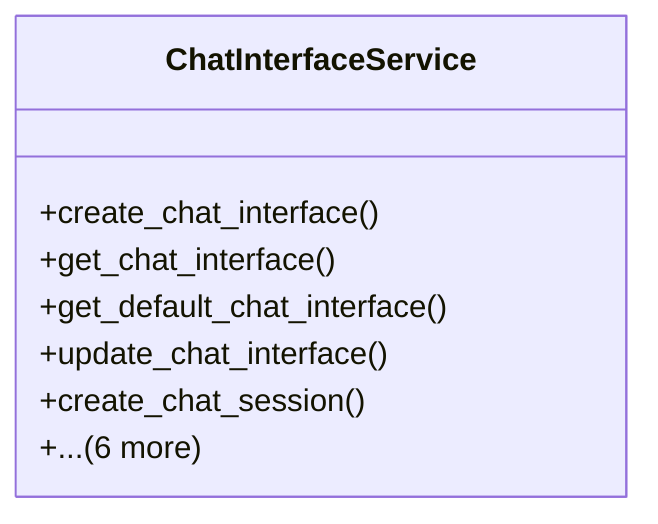

# integration_modules.ai_ui.services.chat_interface_service

## Imports
- django.contrib.auth
- django.db
- django.utils
- models

## Classes
- ChatInterfaceService
  - method: `create_chat_interface`
  - method: `get_chat_interface`
  - method: `get_default_chat_interface`
  - method: `update_chat_interface`
  - method: `create_chat_session`
  - method: `get_chat_session`
  - method: `get_user_chat_sessions`
  - method: `add_chat_message`
  - method: `get_chat_messages`
  - method: `close_chat_session`
  - method: `delete_chat_session`

## Functions
- create_chat_interface
- get_chat_interface
- get_default_chat_interface
- update_chat_interface
- create_chat_session
- get_chat_session
- get_user_chat_sessions
- add_chat_message
- get_chat_messages
- close_chat_session
- delete_chat_session

## Class Diagram

