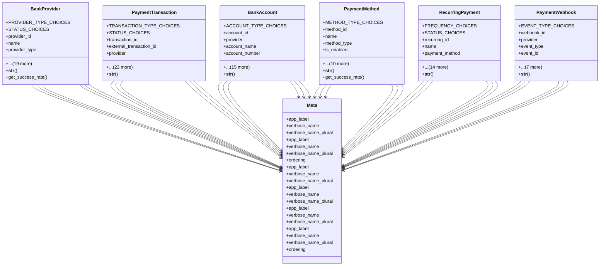

# integration_modules.banking_payments.models

## Imports
- django.conf
- django.db
- django.utils
- django.utils.translation
- uuid

## Classes
- BankProvider
  - attr: `PROVIDER_TYPE_CHOICES`
  - attr: `STATUS_CHOICES`
  - attr: `provider_id`
  - attr: `name`
  - attr: `provider_type`
  - attr: `status`
  - attr: `api_endpoint`
  - attr: `api_version`
  - attr: `documentation_url`
  - attr: `api_key`
  - attr: `secret_key`
  - attr: `webhook_url`
  - attr: `supported_currencies`
  - attr: `transaction_fee_percentage`
  - attr: `fixed_fee`
  - attr: `min_transaction_amount`
  - attr: `max_transaction_amount`
  - attr: `configuration`
  - attr: `total_transactions`
  - attr: `successful_transactions`
  - attr: `last_used`
  - attr: `created_at`
  - attr: `updated_at`
  - attr: `is_active`
  - method: `__str__`
  - method: `get_success_rate`
- PaymentTransaction
  - attr: `TRANSACTION_TYPE_CHOICES`
  - attr: `STATUS_CHOICES`
  - attr: `transaction_id`
  - attr: `external_transaction_id`
  - attr: `provider`
  - attr: `transaction_type`
  - attr: `status`
  - attr: `amount`
  - attr: `currency`
  - attr: `fee_amount`
  - attr: `net_amount`
  - attr: `payer_name`
  - attr: `payer_email`
  - attr: `payer_phone`
  - attr: `recipient_name`
  - attr: `recipient_account`
  - attr: `description`
  - attr: `reference_number`
  - attr: `related_model`
  - attr: `related_object_id`
  - attr: `raw_request`
  - attr: `raw_response`
  - attr: `initiated_at`
  - attr: `processed_at`
  - attr: `completed_at`
  - attr: `error_code`
  - attr: `error_message`
  - attr: `created_by`
  - method: `__str__`
- BankAccount
  - attr: `ACCOUNT_TYPE_CHOICES`
  - attr: `account_id`
  - attr: `provider`
  - attr: `account_name`
  - attr: `account_number`
  - attr: `account_type`
  - attr: `bank_name`
  - attr: `bank_code`
  - attr: `branch_name`
  - attr: `branch_code`
  - attr: `current_balance`
  - attr: `available_balance`
  - attr: `currency`
  - attr: `auto_sync`
  - attr: `last_sync`
  - attr: `sync_frequency`
  - attr: `is_active`
  - attr: `is_default`
  - attr: `created_at`
  - attr: `updated_at`
  - method: `__str__`
- PaymentMethod
  - attr: `METHOD_TYPE_CHOICES`
  - attr: `method_id`
  - attr: `name`
  - attr: `method_type`
  - attr: `is_enabled`
  - attr: `requires_verification`
  - attr: `fee_percentage`
  - attr: `fixed_fee`
  - attr: `min_amount`
  - attr: `max_amount`
  - attr: `configuration`
  - attr: `usage_count`
  - attr: `success_count`
  - attr: `created_at`
  - attr: `updated_at`
  - method: `__str__`
  - method: `get_success_rate`
- RecurringPayment
  - attr: `FREQUENCY_CHOICES`
  - attr: `STATUS_CHOICES`
  - attr: `recurring_id`
  - attr: `name`
  - attr: `payment_method`
  - attr: `amount`
  - attr: `currency`
  - attr: `frequency`
  - attr: `start_date`
  - attr: `end_date`
  - attr: `next_payment_date`
  - attr: `status`
  - attr: `total_payments`
  - attr: `successful_payments`
  - attr: `failed_payments`
  - attr: `description`
  - attr: `created_by`
  - attr: `created_at`
  - attr: `updated_at`
  - method: `__str__`
- PaymentWebhook
  - attr: `EVENT_TYPE_CHOICES`
  - attr: `webhook_id`
  - attr: `provider`
  - attr: `event_type`
  - attr: `event_id`
  - attr: `payload`
  - attr: `headers`
  - attr: `processed`
  - attr: `processed_at`
  - attr: `error_message`
  - attr: `retry_count`
  - attr: `received_at`
  - method: `__str__`
- Meta
  - attr: `app_label`
  - attr: `verbose_name`
  - attr: `verbose_name_plural`
- Meta
  - attr: `app_label`
  - attr: `verbose_name`
  - attr: `verbose_name_plural`
  - attr: `ordering`
- Meta
  - attr: `app_label`
  - attr: `verbose_name`
  - attr: `verbose_name_plural`
- Meta
  - attr: `app_label`
  - attr: `verbose_name`
  - attr: `verbose_name_plural`
- Meta
  - attr: `app_label`
  - attr: `verbose_name`
  - attr: `verbose_name_plural`
- Meta
  - attr: `app_label`
  - attr: `verbose_name`
  - attr: `verbose_name_plural`
  - attr: `ordering`

## Functions
- __str__
- get_success_rate
- __str__
- __str__
- __str__
- get_success_rate
- __str__
- __str__

## Class Diagram

