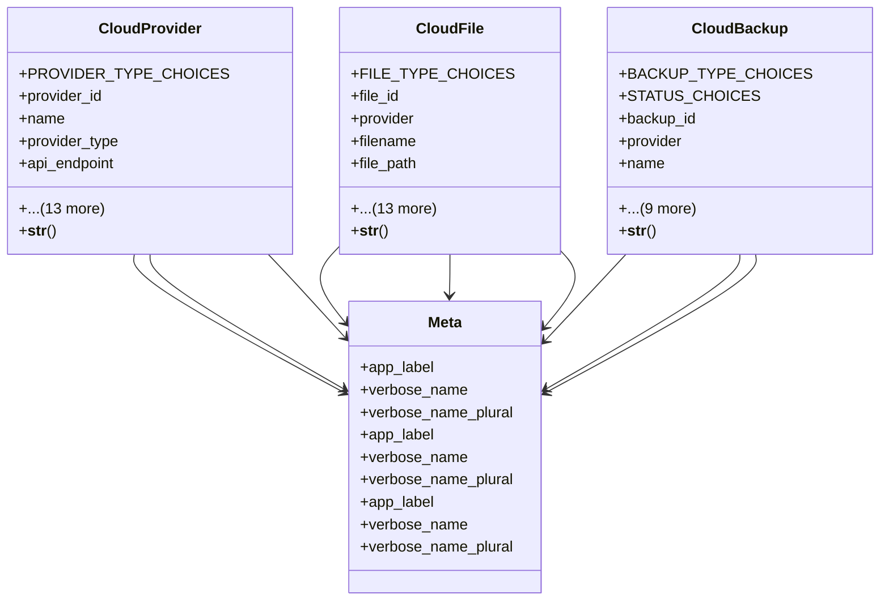

# integration_modules.cloud_services.models

## Imports
- django.conf
- django.db
- django.utils.translation
- uuid

## Classes
- CloudProvider
  - attr: `PROVIDER_TYPE_CHOICES`
  - attr: `provider_id`
  - attr: `name`
  - attr: `provider_type`
  - attr: `api_endpoint`
  - attr: `access_key`
  - attr: `secret_key`
  - attr: `region`
  - attr: `bucket_name`
  - attr: `storage_quota`
  - attr: `used_storage`
  - attr: `total_files`
  - attr: `total_uploads`
  - attr: `total_downloads`
  - attr: `is_active`
  - attr: `is_default`
  - attr: `created_at`
  - attr: `updated_at`
  - method: `__str__`
- CloudFile
  - attr: `FILE_TYPE_CHOICES`
  - attr: `file_id`
  - attr: `provider`
  - attr: `filename`
  - attr: `file_path`
  - attr: `file_type`
  - attr: `file_size`
  - attr: `mime_type`
  - attr: `public_url`
  - attr: `download_url`
  - attr: `is_public`
  - attr: `upload_progress`
  - attr: `checksum`
  - attr: `download_count`
  - attr: `last_accessed`
  - attr: `uploaded_by`
  - attr: `uploaded_at`
  - attr: `updated_at`
  - method: `__str__`
- CloudBackup
  - attr: `BACKUP_TYPE_CHOICES`
  - attr: `STATUS_CHOICES`
  - attr: `backup_id`
  - attr: `provider`
  - attr: `name`
  - attr: `backup_type`
  - attr: `status`
  - attr: `source_path`
  - attr: `backup_path`
  - attr: `backup_size`
  - attr: `started_at`
  - attr: `completed_at`
  - attr: `error_message`
  - attr: `created_at`
  - method: `__str__`
- Meta
  - attr: `app_label`
  - attr: `verbose_name`
  - attr: `verbose_name_plural`
- Meta
  - attr: `app_label`
  - attr: `verbose_name`
  - attr: `verbose_name_plural`
- Meta
  - attr: `app_label`
  - attr: `verbose_name`
  - attr: `verbose_name_plural`

## Functions
- __str__
- __str__
- __str__

## Class Diagram

