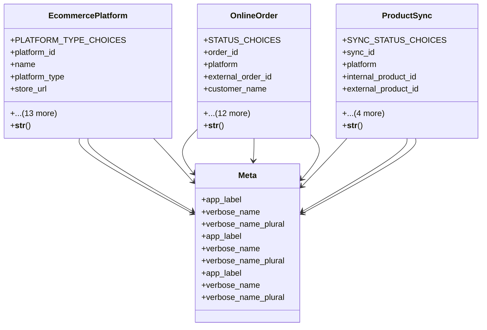

# integration_modules.ecommerce.models

## Imports
- django.conf
- django.db
- django.utils
- django.utils.translation
- uuid

## Classes
- EcommercePlatform
  - attr: `PLATFORM_TYPE_CHOICES`
  - attr: `platform_id`
  - attr: `name`
  - attr: `platform_type`
  - attr: `store_url`
  - attr: `api_endpoint`
  - attr: `api_key`
  - attr: `secret_key`
  - attr: `auto_sync_products`
  - attr: `auto_sync_orders`
  - attr: `auto_sync_inventory`
  - attr: `sync_frequency`
  - attr: `total_products`
  - attr: `total_orders`
  - attr: `last_sync`
  - attr: `is_active`
  - attr: `created_at`
  - attr: `updated_at`
  - method: `__str__`
- OnlineOrder
  - attr: `STATUS_CHOICES`
  - attr: `order_id`
  - attr: `platform`
  - attr: `external_order_id`
  - attr: `customer_name`
  - attr: `customer_email`
  - attr: `customer_phone`
  - attr: `status`
  - attr: `total_amount`
  - attr: `currency`
  - attr: `shipping_address`
  - attr: `billing_address`
  - attr: `shipping_method`
  - attr: `tracking_number`
  - attr: `raw_data`
  - attr: `order_date`
  - attr: `synced_at`
  - method: `__str__`
- ProductSync
  - attr: `SYNC_STATUS_CHOICES`
  - attr: `sync_id`
  - attr: `platform`
  - attr: `internal_product_id`
  - attr: `external_product_id`
  - attr: `sync_status`
  - attr: `last_sync`
  - attr: `error_message`
  - attr: `sync_data`
  - method: `__str__`
- Meta
  - attr: `app_label`
  - attr: `verbose_name`
  - attr: `verbose_name_plural`
- Meta
  - attr: `app_label`
  - attr: `verbose_name`
  - attr: `verbose_name_plural`
- Meta
  - attr: `app_label`
  - attr: `verbose_name`
  - attr: `verbose_name_plural`

## Functions
- __str__
- __str__
- __str__

## Class Diagram

