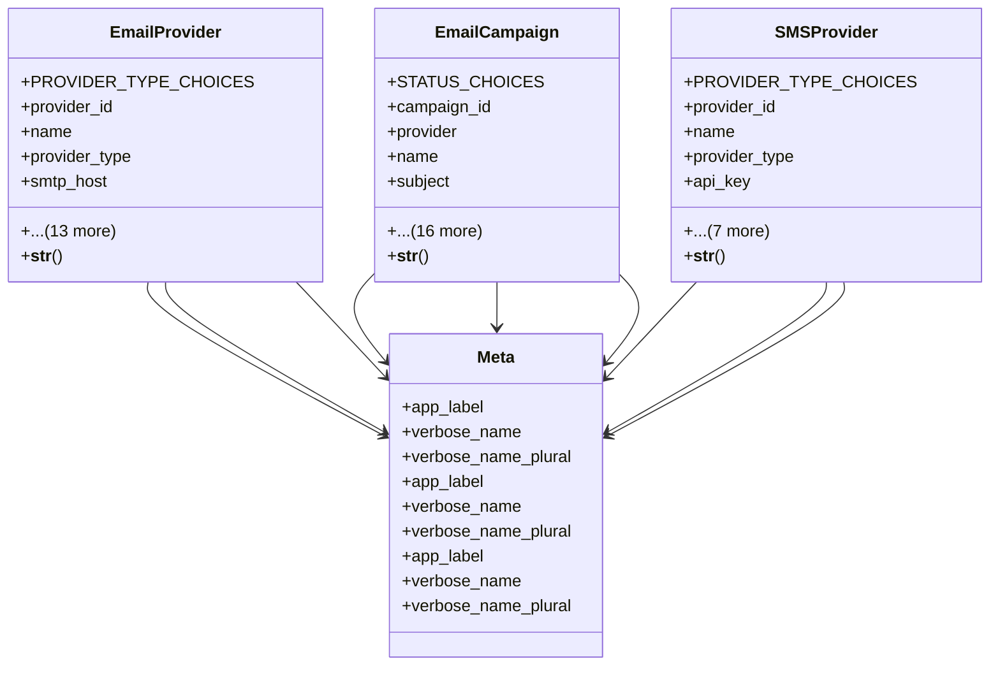

# integration_modules.email_messaging.models

## Imports
- django.conf
- django.db
- django.utils.translation
- uuid

## Classes
- EmailProvider
  - attr: `PROVIDER_TYPE_CHOICES`
  - attr: `provider_id`
  - attr: `name`
  - attr: `provider_type`
  - attr: `smtp_host`
  - attr: `smtp_port`
  - attr: `smtp_username`
  - attr: `smtp_password`
  - attr: `use_tls`
  - attr: `api_key`
  - attr: `api_secret`
  - attr: `emails_sent`
  - attr: `emails_delivered`
  - attr: `emails_bounced`
  - attr: `is_active`
  - attr: `is_default`
  - attr: `created_at`
  - attr: `updated_at`
  - method: `__str__`
- EmailCampaign
  - attr: `STATUS_CHOICES`
  - attr: `campaign_id`
  - attr: `provider`
  - attr: `name`
  - attr: `subject`
  - attr: `content`
  - attr: `sender_name`
  - attr: `sender_email`
  - attr: `reply_to`
  - attr: `recipient_list`
  - attr: `status`
  - attr: `scheduled_time`
  - attr: `sent_time`
  - attr: `total_recipients`
  - attr: `emails_sent`
  - attr: `emails_delivered`
  - attr: `emails_opened`
  - attr: `links_clicked`
  - attr: `created_by`
  - attr: `created_at`
  - attr: `updated_at`
  - method: `__str__`
- SMSProvider
  - attr: `PROVIDER_TYPE_CHOICES`
  - attr: `provider_id`
  - attr: `name`
  - attr: `provider_type`
  - attr: `api_key`
  - attr: `api_secret`
  - attr: `sender_id`
  - attr: `sms_sent`
  - attr: `sms_delivered`
  - attr: `is_active`
  - attr: `created_at`
  - attr: `updated_at`
  - method: `__str__`
- Meta
  - attr: `app_label`
  - attr: `verbose_name`
  - attr: `verbose_name_plural`
- Meta
  - attr: `app_label`
  - attr: `verbose_name`
  - attr: `verbose_name_plural`
- Meta
  - attr: `app_label`
  - attr: `verbose_name`
  - attr: `verbose_name_plural`

## Functions
- __str__
- __str__
- __str__

## Class Diagram

