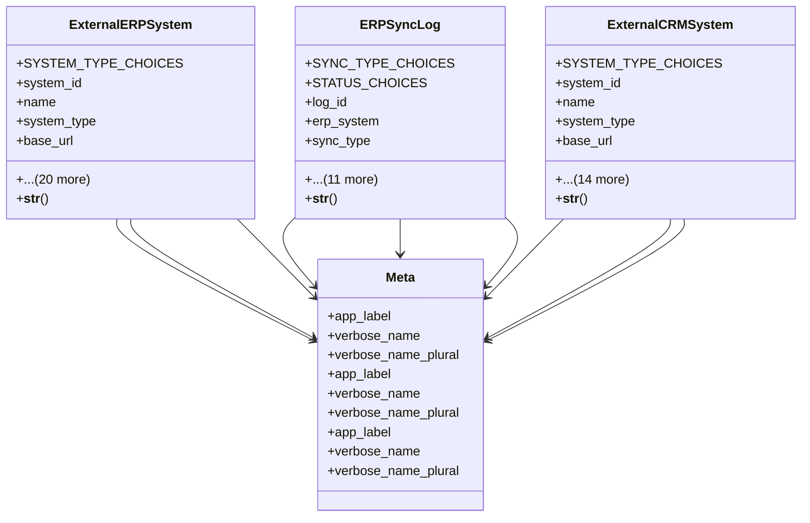

# integration_modules.external_erp.models

## Imports
- django.conf
- django.db
- django.utils.translation
- uuid

## Classes
- ExternalERPSystem
  - attr: `SYSTEM_TYPE_CHOICES`
  - attr: `system_id`
  - attr: `name`
  - attr: `system_type`
  - attr: `base_url`
  - attr: `api_endpoint`
  - attr: `api_version`
  - attr: `username`
  - attr: `password`
  - attr: `api_key`
  - attr: `client_id`
  - attr: `client_secret`
  - attr: `sync_customers`
  - attr: `sync_suppliers`
  - attr: `sync_products`
  - attr: `sync_orders`
  - attr: `sync_invoices`
  - attr: `sync_inventory`
  - attr: `sync_frequency`
  - attr: `last_sync`
  - attr: `total_syncs`
  - attr: `successful_syncs`
  - attr: `is_active`
  - attr: `created_at`
  - attr: `updated_at`
  - method: `__str__`
- ERPSyncLog
  - attr: `SYNC_TYPE_CHOICES`
  - attr: `STATUS_CHOICES`
  - attr: `log_id`
  - attr: `erp_system`
  - attr: `sync_type`
  - attr: `data_type`
  - attr: `status`
  - attr: `records_processed`
  - attr: `records_successful`
  - attr: `records_failed`
  - attr: `started_at`
  - attr: `completed_at`
  - attr: `error_message`
  - attr: `error_details`
  - attr: `sync_data`
  - attr: `created_at`
  - method: `__str__`
- ExternalCRMSystem
  - attr: `SYSTEM_TYPE_CHOICES`
  - attr: `system_id`
  - attr: `name`
  - attr: `system_type`
  - attr: `base_url`
  - attr: `api_endpoint`
  - attr: `api_key`
  - attr: `access_token`
  - attr: `refresh_token`
  - attr: `sync_contacts`
  - attr: `sync_leads`
  - attr: `sync_opportunities`
  - attr: `sync_activities`
  - attr: `total_contacts`
  - attr: `total_leads`
  - attr: `last_sync`
  - attr: `is_active`
  - attr: `created_at`
  - attr: `updated_at`
  - method: `__str__`
- Meta
  - attr: `app_label`
  - attr: `verbose_name`
  - attr: `verbose_name_plural`
- Meta
  - attr: `app_label`
  - attr: `verbose_name`
  - attr: `verbose_name_plural`
- Meta
  - attr: `app_label`
  - attr: `verbose_name`
  - attr: `verbose_name_plural`

## Functions
- __str__
- __str__
- __str__

## Class Diagram

