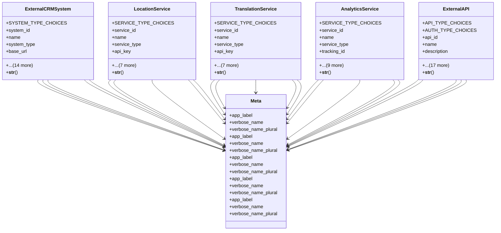

# integration_modules.maps_location.models

## Imports
- django.conf
- django.db
- django.utils.translation
- uuid

## Classes
- ExternalCRMSystem
  - attr: `SYSTEM_TYPE_CHOICES`
  - attr: `system_id`
  - attr: `name`
  - attr: `system_type`
  - attr: `base_url`
  - attr: `api_endpoint`
  - attr: `api_key`
  - attr: `access_token`
  - attr: `refresh_token`
  - attr: `sync_contacts`
  - attr: `sync_leads`
  - attr: `sync_opportunities`
  - attr: `sync_activities`
  - attr: `total_contacts`
  - attr: `total_leads`
  - attr: `last_sync`
  - attr: `is_active`
  - attr: `created_at`
  - attr: `updated_at`
  - method: `__str__`
- LocationService
  - attr: `SERVICE_TYPE_CHOICES`
  - attr: `service_id`
  - attr: `name`
  - attr: `service_type`
  - attr: `api_key`
  - attr: `api_endpoint`
  - attr: `daily_quota`
  - attr: `used_today`
  - attr: `is_active`
  - attr: `is_default`
  - attr: `created_at`
  - attr: `updated_at`
  - method: `__str__`
- TranslationService
  - attr: `SERVICE_TYPE_CHOICES`
  - attr: `service_id`
  - attr: `name`
  - attr: `service_type`
  - attr: `api_key`
  - attr: `api_endpoint`
  - attr: `supported_languages`
  - attr: `characters_translated`
  - attr: `translation_requests`
  - attr: `is_active`
  - attr: `created_at`
  - attr: `updated_at`
  - method: `__str__`
- AnalyticsService
  - attr: `SERVICE_TYPE_CHOICES`
  - attr: `service_id`
  - attr: `name`
  - attr: `service_type`
  - attr: `tracking_id`
  - attr: `api_key`
  - attr: `track_pageviews`
  - attr: `track_events`
  - attr: `track_conversions`
  - attr: `total_events`
  - attr: `total_pageviews`
  - attr: `is_active`
  - attr: `created_at`
  - attr: `updated_at`
  - method: `__str__`
- ExternalAPI
  - attr: `API_TYPE_CHOICES`
  - attr: `AUTH_TYPE_CHOICES`
  - attr: `api_id`
  - attr: `name`
  - attr: `description`
  - attr: `api_type`
  - attr: `base_url`
  - attr: `version`
  - attr: `auth_type`
  - attr: `api_key`
  - attr: `username`
  - attr: `password`
  - attr: `timeout`
  - attr: `retry_attempts`
  - attr: `rate_limit`
  - attr: `total_requests`
  - attr: `successful_requests`
  - attr: `failed_requests`
  - attr: `average_response_time`
  - attr: `is_active`
  - attr: `created_at`
  - attr: `updated_at`
  - method: `__str__`
- Meta
  - attr: `app_label`
  - attr: `verbose_name`
  - attr: `verbose_name_plural`
- Meta
  - attr: `app_label`
  - attr: `verbose_name`
  - attr: `verbose_name_plural`
- Meta
  - attr: `app_label`
  - attr: `verbose_name`
  - attr: `verbose_name_plural`
- Meta
  - attr: `app_label`
  - attr: `verbose_name`
  - attr: `verbose_name_plural`
- Meta
  - attr: `app_label`
  - attr: `verbose_name`
  - attr: `verbose_name_plural`

## Functions
- __str__
- __str__
- __str__
- __str__
- __str__

## Class Diagram

