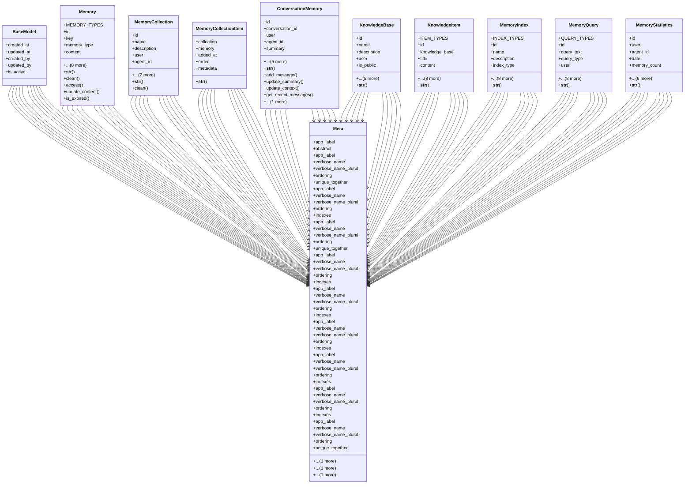

# integration_modules.memory_ai.models

## Imports
- django.conf
- django.core.exceptions
- django.db
- django.utils
- django.utils.translation
- json
- uuid

## Classes
- BaseModel
  - attr: `created_at`
  - attr: `updated_at`
  - attr: `created_by`
  - attr: `updated_by`
  - attr: `is_active`
- Memory
  - attr: `MEMORY_TYPES`
  - attr: `id`
  - attr: `key`
  - attr: `memory_type`
  - attr: `content`
  - attr: `metadata`
  - attr: `expiry_date`
  - attr: `user`
  - attr: `agent_id`
  - attr: `importance`
  - attr: `embedding`
  - attr: `last_accessed`
  - attr: `access_count`
  - method: `__str__`
  - method: `clean`
  - method: `access`
  - method: `update_content`
  - method: `is_expired`
- MemoryCollection
  - attr: `id`
  - attr: `name`
  - attr: `description`
  - attr: `user`
  - attr: `agent_id`
  - attr: `metadata`
  - attr: `is_default`
  - method: `__str__`
  - method: `clean`
- MemoryCollectionItem
  - attr: `collection`
  - attr: `memory`
  - attr: `added_at`
  - attr: `order`
  - attr: `metadata`
  - method: `__str__`
- ConversationMemory
  - attr: `id`
  - attr: `conversation_id`
  - attr: `user`
  - attr: `agent_id`
  - attr: `summary`
  - attr: `context`
  - attr: `messages`
  - attr: `metadata`
  - attr: `last_updated`
  - attr: `expiry_date`
  - method: `__str__`
  - method: `add_message`
  - method: `update_summary`
  - method: `update_context`
  - method: `get_recent_messages`
  - method: `is_expired`
- KnowledgeBase
  - attr: `id`
  - attr: `name`
  - attr: `description`
  - attr: `user`
  - attr: `is_public`
  - attr: `metadata`
  - attr: `vector_store_id`
  - attr: `embedding_model`
  - attr: `created_at`
  - attr: `updated_at`
  - method: `__str__`
- KnowledgeItem
  - attr: `ITEM_TYPES`
  - attr: `id`
  - attr: `knowledge_base`
  - attr: `title`
  - attr: `content`
  - attr: `item_type`
  - attr: `source_url`
  - attr: `metadata`
  - attr: `embedding`
  - attr: `embedding_model`
  - attr: `vector_id`
  - attr: `created_at`
  - attr: `updated_at`
  - method: `__str__`
- MemoryIndex
  - attr: `INDEX_TYPES`
  - attr: `id`
  - attr: `name`
  - attr: `description`
  - attr: `index_type`
  - attr: `user`
  - attr: `agent_id`
  - attr: `config`
  - attr: `metadata`
  - attr: `external_id`
  - attr: `created_at`
  - attr: `updated_at`
  - attr: `last_optimized`
  - method: `__str__`
- MemoryQuery
  - attr: `QUERY_TYPES`
  - attr: `id`
  - attr: `query_text`
  - attr: `query_type`
  - attr: `user`
  - attr: `agent_id`
  - attr: `index`
  - attr: `parameters`
  - attr: `results`
  - attr: `execution_time_ms`
  - attr: `timestamp`
  - attr: `conversation_id`
  - attr: `metadata`
  - method: `__str__`
- MemoryStatistics
  - attr: `id`
  - attr: `user`
  - attr: `agent_id`
  - attr: `date`
  - attr: `memory_count`
  - attr: `query_count`
  - attr: `avg_query_time_ms`
  - attr: `storage_bytes`
  - attr: `conversation_count`
  - attr: `knowledge_item_count`
  - attr: `statistics`
  - method: `__str__`
- Meta
  - attr: `app_label`
  - attr: `abstract`
- Meta
  - attr: `app_label`
  - attr: `verbose_name`
  - attr: `verbose_name_plural`
  - attr: `ordering`
  - attr: `unique_together`
  - attr: `indexes`
- Meta
  - attr: `app_label`
  - attr: `verbose_name`
  - attr: `verbose_name_plural`
  - attr: `ordering`
  - attr: `indexes`
- Meta
  - attr: `app_label`
  - attr: `verbose_name`
  - attr: `verbose_name_plural`
  - attr: `ordering`
  - attr: `unique_together`
  - attr: `indexes`
- Meta
  - attr: `app_label`
  - attr: `verbose_name`
  - attr: `verbose_name_plural`
  - attr: `ordering`
  - attr: `indexes`
- Meta
  - attr: `app_label`
  - attr: `verbose_name`
  - attr: `verbose_name_plural`
  - attr: `ordering`
  - attr: `indexes`
- Meta
  - attr: `app_label`
  - attr: `verbose_name`
  - attr: `verbose_name_plural`
  - attr: `ordering`
  - attr: `indexes`
- Meta
  - attr: `app_label`
  - attr: `verbose_name`
  - attr: `verbose_name_plural`
  - attr: `ordering`
  - attr: `indexes`
- Meta
  - attr: `app_label`
  - attr: `verbose_name`
  - attr: `verbose_name_plural`
  - attr: `ordering`
  - attr: `indexes`
- Meta
  - attr: `app_label`
  - attr: `verbose_name`
  - attr: `verbose_name_plural`
  - attr: `ordering`
  - attr: `unique_together`
  - attr: `indexes`

## Functions
- __str__
- clean
- access
- update_content
- is_expired
- __str__
- clean
- __str__
- __str__
- add_message
- update_summary
- update_context
- get_recent_messages
- is_expired
- __str__
- __str__
- __str__
- __str__
- __str__

## Class Diagram

