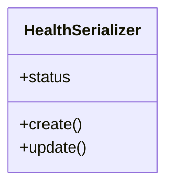

# integration_modules.memory_ai.serializers

## Imports
- rest_framework

## Classes
- HealthSerializer
  - attr: `status`
  - method: `create`
  - method: `update`

## Functions
- create
- update

## Class Diagram

