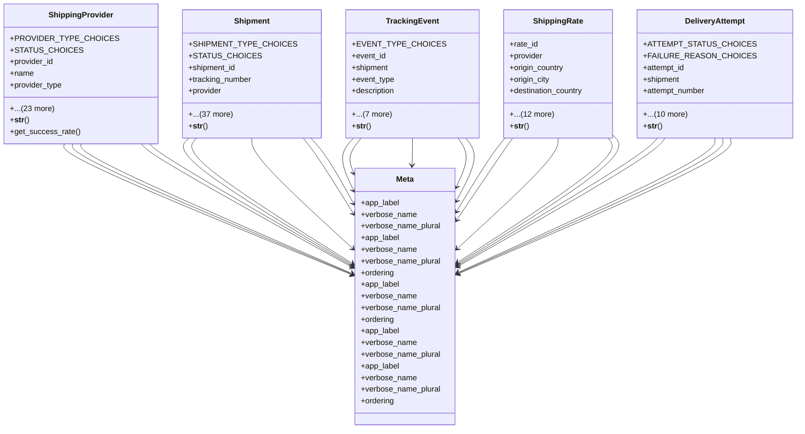

# integration_modules.shipping_logistics.models

## Imports
- django.conf
- django.db
- django.utils
- django.utils.translation
- uuid

## Classes
- ShippingProvider
  - attr: `PROVIDER_TYPE_CHOICES`
  - attr: `STATUS_CHOICES`
  - attr: `provider_id`
  - attr: `name`
  - attr: `provider_type`
  - attr: `status`
  - attr: `api_endpoint`
  - attr: `api_version`
  - attr: `tracking_url_template`
  - attr: `api_key`
  - attr: `username`
  - attr: `password`
  - attr: `supported_countries`
  - attr: `supported_cities`
  - attr: `service_types`
  - attr: `base_rate`
  - attr: `rate_per_kg`
  - attr: `rate_per_km`
  - attr: `max_weight`
  - attr: `max_dimensions`
  - attr: `configuration`
  - attr: `total_shipments`
  - attr: `successful_shipments`
  - attr: `average_delivery_time`
  - attr: `rating`
  - attr: `created_at`
  - attr: `updated_at`
  - attr: `is_active`
  - method: `__str__`
  - method: `get_success_rate`
- Shipment
  - attr: `SHIPMENT_TYPE_CHOICES`
  - attr: `STATUS_CHOICES`
  - attr: `shipment_id`
  - attr: `tracking_number`
  - attr: `provider`
  - attr: `shipment_type`
  - attr: `status`
  - attr: `sender_name`
  - attr: `sender_phone`
  - attr: `sender_email`
  - attr: `sender_address`
  - attr: `sender_city`
  - attr: `sender_country`
  - attr: `sender_postal_code`
  - attr: `recipient_name`
  - attr: `recipient_phone`
  - attr: `recipient_email`
  - attr: `recipient_address`
  - attr: `recipient_city`
  - attr: `recipient_country`
  - attr: `recipient_postal_code`
  - attr: `weight`
  - attr: `dimensions`
  - attr: `description`
  - attr: `declared_value`
  - attr: `shipping_cost`
  - attr: `insurance_cost`
  - attr: `total_cost`
  - attr: `currency`
  - attr: `pickup_date`
  - attr: `estimated_delivery`
  - attr: `actual_delivery`
  - attr: `special_instructions`
  - attr: `requires_signature`
  - attr: `is_fragile`
  - attr: `related_model`
  - attr: `related_object_id`
  - attr: `raw_request`
  - attr: `raw_response`
  - attr: `created_by`
  - attr: `created_at`
  - attr: `updated_at`
  - method: `__str__`
- TrackingEvent
  - attr: `EVENT_TYPE_CHOICES`
  - attr: `event_id`
  - attr: `shipment`
  - attr: `event_type`
  - attr: `description`
  - attr: `location`
  - attr: `city`
  - attr: `country`
  - attr: `event_time`
  - attr: `notes`
  - attr: `raw_data`
  - attr: `created_at`
  - method: `__str__`
- ShippingRate
  - attr: `rate_id`
  - attr: `provider`
  - attr: `origin_country`
  - attr: `origin_city`
  - attr: `destination_country`
  - attr: `destination_city`
  - attr: `service_type`
  - attr: `min_weight`
  - attr: `max_weight`
  - attr: `base_rate`
  - attr: `rate_per_kg`
  - attr: `fuel_surcharge`
  - attr: `estimated_days`
  - attr: `is_active`
  - attr: `effective_from`
  - attr: `effective_to`
  - attr: `created_at`
  - method: `__str__`
- DeliveryAttempt
  - attr: `ATTEMPT_STATUS_CHOICES`
  - attr: `FAILURE_REASON_CHOICES`
  - attr: `attempt_id`
  - attr: `shipment`
  - attr: `attempt_number`
  - attr: `attempt_date`
  - attr: `status`
  - attr: `failure_reason`
  - attr: `failure_notes`
  - attr: `delivered_to`
  - attr: `signature`
  - attr: `rescheduled_date`
  - attr: `driver_name`
  - attr: `driver_phone`
  - attr: `created_at`
  - method: `__str__`
- Meta
  - attr: `app_label`
  - attr: `verbose_name`
  - attr: `verbose_name_plural`
- Meta
  - attr: `app_label`
  - attr: `verbose_name`
  - attr: `verbose_name_plural`
  - attr: `ordering`
- Meta
  - attr: `app_label`
  - attr: `verbose_name`
  - attr: `verbose_name_plural`
  - attr: `ordering`
- Meta
  - attr: `app_label`
  - attr: `verbose_name`
  - attr: `verbose_name_plural`
- Meta
  - attr: `app_label`
  - attr: `verbose_name`
  - attr: `verbose_name_plural`
  - attr: `ordering`

## Functions
- __str__
- get_success_rate
- __str__
- __str__
- __str__
- __str__

## Class Diagram

