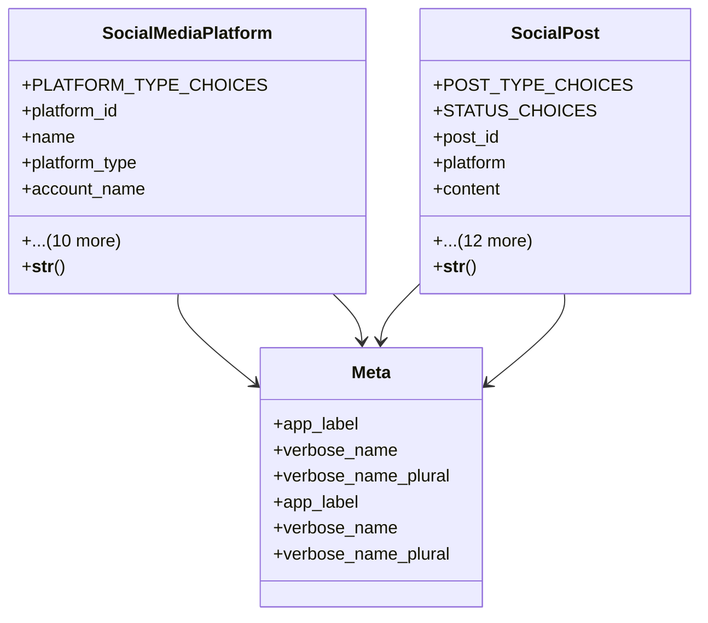

# integration_modules.social_media.models

## Imports
- django.conf
- django.db
- django.utils.translation
- uuid

## Classes
- SocialMediaPlatform
  - attr: `PLATFORM_TYPE_CHOICES`
  - attr: `platform_id`
  - attr: `name`
  - attr: `platform_type`
  - attr: `account_name`
  - attr: `account_url`
  - attr: `api_key`
  - attr: `access_token`
  - attr: `refresh_token`
  - attr: `followers_count`
  - attr: `posts_count`
  - attr: `engagement_rate`
  - attr: `is_active`
  - attr: `created_at`
  - attr: `updated_at`
  - method: `__str__`
- SocialPost
  - attr: `POST_TYPE_CHOICES`
  - attr: `STATUS_CHOICES`
  - attr: `post_id`
  - attr: `platform`
  - attr: `content`
  - attr: `post_type`
  - attr: `media_urls`
  - attr: `status`
  - attr: `scheduled_time`
  - attr: `published_time`
  - attr: `likes_count`
  - attr: `comments_count`
  - attr: `shares_count`
  - attr: `views_count`
  - attr: `created_by`
  - attr: `created_at`
  - attr: `updated_at`
  - method: `__str__`
- Meta
  - attr: `app_label`
  - attr: `verbose_name`
  - attr: `verbose_name_plural`
- Meta
  - attr: `app_label`
  - attr: `verbose_name`
  - attr: `verbose_name_plural`

## Functions
- __str__
- __str__

## Class Diagram

