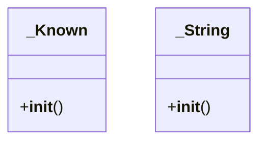

# main-frontend.node_modules..pnpm.flatted@3.3.3.node_modules.flatted.python.flatted

## Imports
- json

## Classes
- _Known
  - method: `__init__`
- _String
  - method: `__init__`

## Functions
- _array_keys
- _object_keys
- _is_array
- _is_object
- _is_string
- _index
- _loop
- _ref
- _relate
- _transform
- _wrap
- parse
- stringify
- __init__
- __init__

## Class Diagram

