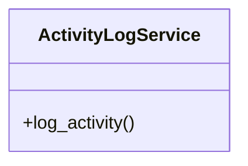

# services.activity_log.services

## Imports
- typing

## Classes
- ActivityLogService
  - method: `log_activity`

## Functions
- log_activity

## Class Diagram

```mermaid
classDiagram
    class ActivityLogService {
        +log_activity()
    }
```
