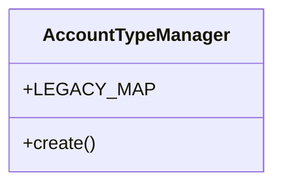

# services_modules.accounting.models

## Imports
- __future__
- business_modules.accounting.models
- business_modules.accounting.models.journal
- django.db

## Classes
- AccountTypeManager
  - attr: `LEGACY_MAP`
  - method: `create`

## Functions
- create

## Module Variables
- `Journal`
- `JournalEntry`
- `JournalEntryLine`
- `__all__`

## Class Diagram

