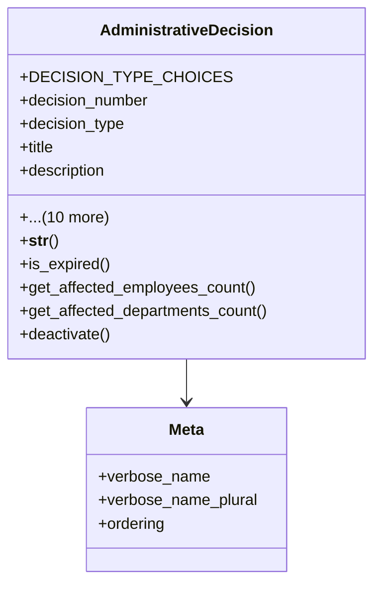

# services_modules.admin_affairs.models.administrative_decision

## Imports
- department
- django.conf
- django.db
- django.utils
- employee_profile

## Classes
- AdministrativeDecision
  - attr: `DECISION_TYPE_CHOICES`
  - attr: `decision_number`
  - attr: `decision_type`
  - attr: `title`
  - attr: `description`
  - attr: `issue_date`
  - attr: `effective_date`
  - attr: `end_date`
  - attr: `issued_by`
  - attr: `affected_employees`
  - attr: `departments`
  - attr: `is_active`
  - attr: `attachment`
  - attr: `created_at`
  - attr: `updated_at`
  - method: `__str__`
  - method: `is_expired`
  - method: `get_affected_employees_count`
  - method: `get_affected_departments_count`
  - method: `deactivate`
- Meta
  - attr: `verbose_name`
  - attr: `verbose_name_plural`
  - attr: `ordering`

## Functions
- __str__
- is_expired
- get_affected_employees_count
- get_affected_departments_count
- deactivate

## Class Diagram

