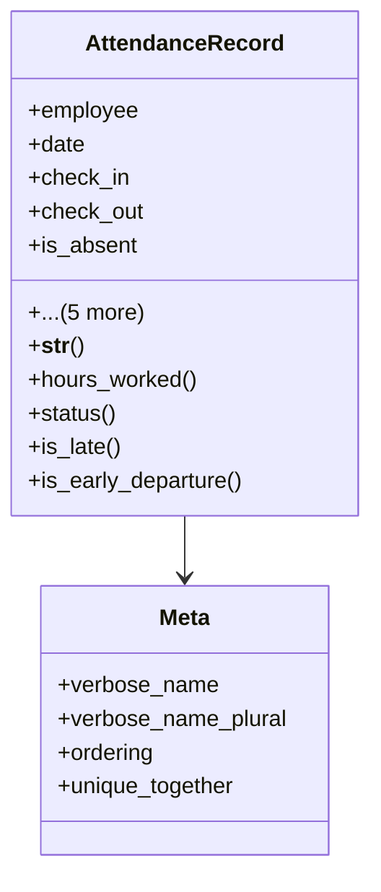

# services_modules.admin_affairs.models.attendance_record

## Imports
- django.db
- django.utils
- employee_profile
- leave

## Classes
- AttendanceRecord
  - attr: `employee`
  - attr: `date`
  - attr: `check_in`
  - attr: `check_out`
  - attr: `is_absent`
  - attr: `is_leave`
  - attr: `leave`
  - attr: `notes`
  - attr: `created_at`
  - attr: `updated_at`
  - method: `__str__`
  - method: `hours_worked`
  - method: `status`
  - method: `is_late`
  - method: `is_early_departure`
- Meta
  - attr: `verbose_name`
  - attr: `verbose_name_plural`
  - attr: `ordering`
  - attr: `unique_together`

## Functions
- __str__
- hours_worked
- status
- is_late
- is_early_departure

## Class Diagram

