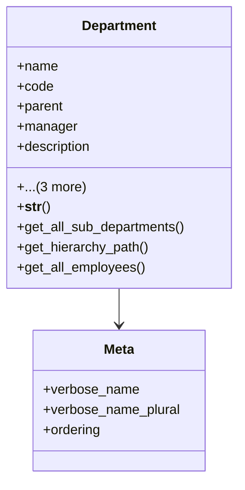

# services_modules.admin_affairs.models.department

## Imports
- django.conf
- django.db
- django.utils
- employee_profile

## Classes
- Department
  - attr: `name`
  - attr: `code`
  - attr: `parent`
  - attr: `manager`
  - attr: `description`
  - attr: `is_active`
  - attr: `created_at`
  - attr: `updated_at`
  - method: `__str__`
  - method: `get_all_sub_departments`
  - method: `get_hierarchy_path`
  - method: `get_all_employees`
- Meta
  - attr: `verbose_name`
  - attr: `verbose_name_plural`
  - attr: `ordering`

## Functions
- __str__
- get_all_sub_departments
- get_hierarchy_path
- get_all_employees

## Class Diagram

