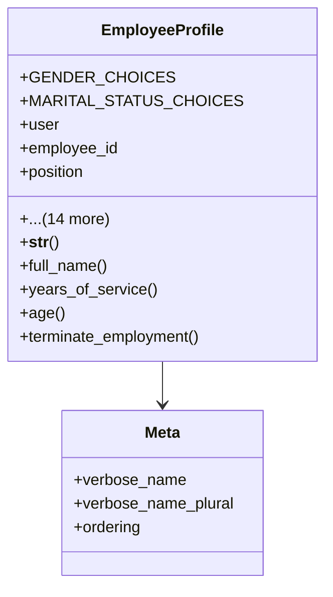

# services_modules.admin_affairs.models.employee_profile

## Imports
- department
- django.conf
- django.db
- django.utils
- position

## Classes
- EmployeeProfile
  - attr: `GENDER_CHOICES`
  - attr: `MARITAL_STATUS_CHOICES`
  - attr: `user`
  - attr: `employee_id`
  - attr: `position`
  - attr: `department`
  - attr: `date_of_birth`
  - attr: `gender`
  - attr: `marital_status`
  - attr: `national_id`
  - attr: `address`
  - attr: `phone_number`
  - attr: `emergency_contact`
  - attr: `emergency_phone`
  - attr: `hire_date`
  - attr: `end_date`
  - attr: `is_active`
  - attr: `created_at`
  - attr: `updated_at`
  - method: `__str__`
  - method: `full_name`
  - method: `years_of_service`
  - method: `age`
  - method: `terminate_employment`
- Meta
  - attr: `verbose_name`
  - attr: `verbose_name_plural`
  - attr: `ordering`

## Functions
- __str__
- full_name
- years_of_service
- age
- terminate_employment

## Class Diagram

