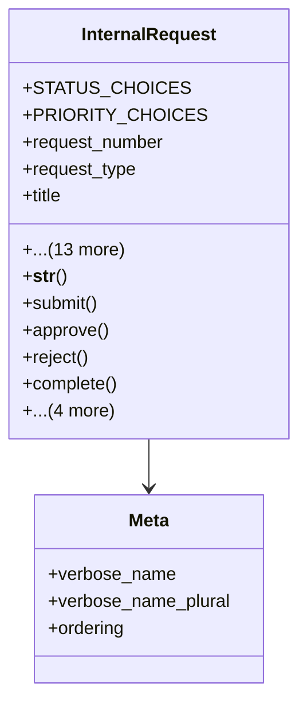

# services_modules.admin_affairs.models.internal_request

## Imports
- department
- django.db
- django.utils
- employee_profile
- internal_request_type

## Classes
- InternalRequest
  - attr: `STATUS_CHOICES`
  - attr: `PRIORITY_CHOICES`
  - attr: `request_number`
  - attr: `request_type`
  - attr: `title`
  - attr: `description`
  - attr: `requester`
  - attr: `department`
  - attr: `priority`
  - attr: `status`
  - attr: `submission_date`
  - attr: `due_date`
  - attr: `completion_date`
  - attr: `assigned_to`
  - attr: `rejection_reason`
  - attr: `attachments`
  - attr: `created_at`
  - attr: `updated_at`
  - method: `__str__`
  - method: `submit`
  - method: `approve`
  - method: `reject`
  - method: `complete`
  - method: `cancel`
  - method: `assign`
  - method: `is_overdue`
  - method: `days_until_due`
- Meta
  - attr: `verbose_name`
  - attr: `verbose_name_plural`
  - attr: `ordering`

## Functions
- __str__
- submit
- approve
- reject
- complete
- cancel
- assign
- is_overdue
- days_until_due

## Class Diagram

