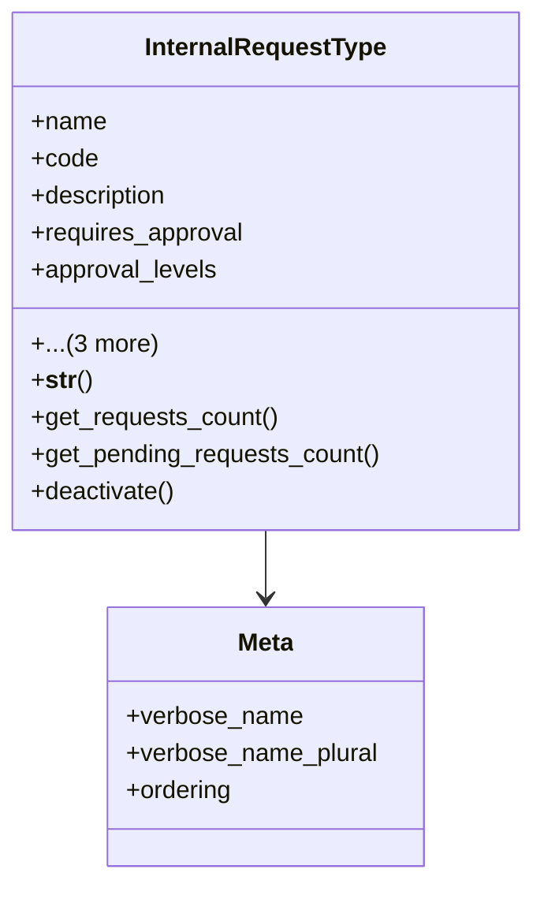

# services_modules.admin_affairs.models.internal_request_type

## Imports
- django.db

## Classes
- InternalRequestType
  - attr: `name`
  - attr: `code`
  - attr: `description`
  - attr: `requires_approval`
  - attr: `approval_levels`
  - attr: `is_active`
  - attr: `created_at`
  - attr: `updated_at`
  - method: `__str__`
  - method: `get_requests_count`
  - method: `get_pending_requests_count`
  - method: `deactivate`
- Meta
  - attr: `verbose_name`
  - attr: `verbose_name_plural`
  - attr: `ordering`

## Functions
- __str__
- get_requests_count
- get_pending_requests_count
- deactivate

## Class Diagram

