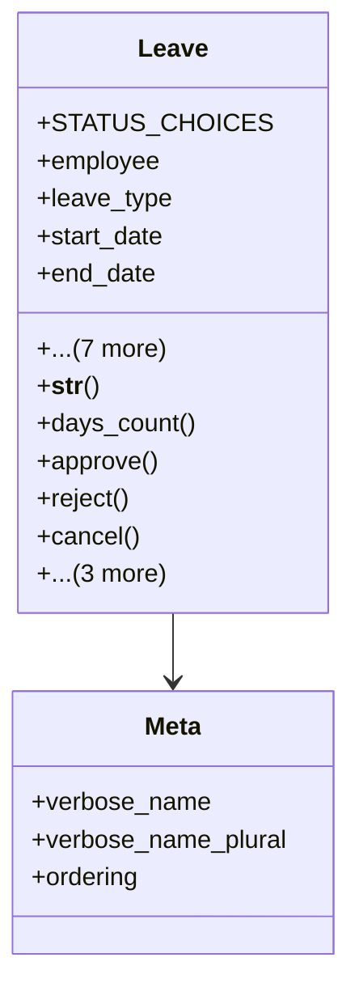

# services_modules.admin_affairs.models.leave

## Imports
- attendance_record
- django.conf
- django.db
- django.utils
- employee_profile
- leave_type

## Classes
- Leave
  - attr: `STATUS_CHOICES`
  - attr: `employee`
  - attr: `leave_type`
  - attr: `start_date`
  - attr: `end_date`
  - attr: `reason`
  - attr: `status`
  - attr: `approved_by`
  - attr: `approved_at`
  - attr: `rejection_reason`
  - attr: `created_at`
  - attr: `updated_at`
  - method: `__str__`
  - method: `days_count`
  - method: `approve`
  - method: `reject`
  - method: `cancel`
  - method: `create_attendance_records`
  - method: `delete_attendance_records`
  - method: `is_overlapping`
- Meta
  - attr: `verbose_name`
  - attr: `verbose_name_plural`
  - attr: `ordering`

## Functions
- __str__
- days_count
- approve
- reject
- cancel
- create_attendance_records
- delete_attendance_records
- is_overlapping

## Class Diagram

