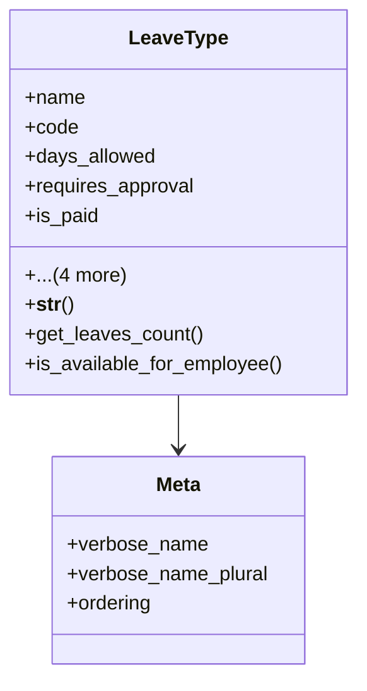

# services_modules.admin_affairs.models.leave_type

## Imports
- django.db
- django.utils
- leave

## Classes
- LeaveType
  - attr: `name`
  - attr: `code`
  - attr: `days_allowed`
  - attr: `requires_approval`
  - attr: `is_paid`
  - attr: `description`
  - attr: `is_active`
  - attr: `created_at`
  - attr: `updated_at`
  - method: `__str__`
  - method: `get_leaves_count`
  - method: `is_available_for_employee`
- Meta
  - attr: `verbose_name`
  - attr: `verbose_name_plural`
  - attr: `ordering`

## Functions
- __str__
- get_leaves_count
- is_available_for_employee

## Class Diagram

