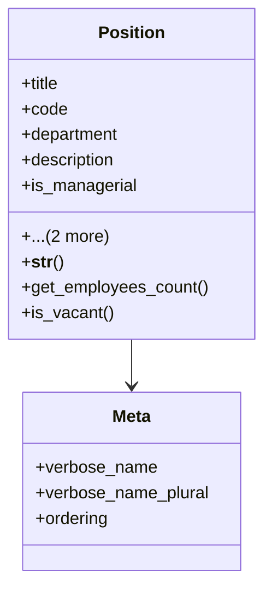

# services_modules.admin_affairs.models.position

## Imports
- department
- django.db

## Classes
- Position
  - attr: `title`
  - attr: `code`
  - attr: `department`
  - attr: `description`
  - attr: `is_managerial`
  - attr: `created_at`
  - attr: `updated_at`
  - method: `__str__`
  - method: `get_employees_count`
  - method: `is_vacant`
- Meta
  - attr: `verbose_name`
  - attr: `verbose_name_plural`
  - attr: `ordering`

## Functions
- __str__
- get_employees_count
- is_vacant

## Class Diagram

