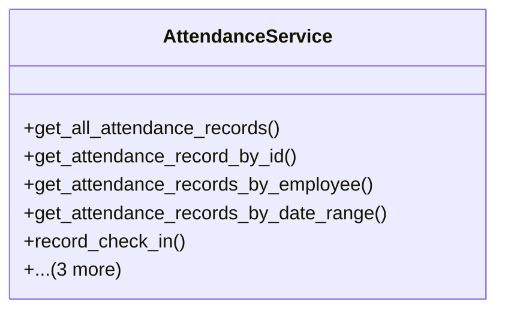

# services_modules.admin_affairs.services.attendance_service

## Imports
- datetime
- django.db
- django.db.models
- django.utils
- models

## Classes
- AttendanceService
  - method: `get_all_attendance_records`
  - method: `get_attendance_record_by_id`
  - method: `get_attendance_records_by_employee`
  - method: `get_attendance_records_by_date_range`
  - method: `record_check_in`
  - method: `record_check_out`
  - method: `mark_absent`
  - method: `get_attendance_statistics`

## Functions
- get_all_attendance_records
- get_attendance_record_by_id
- get_attendance_records_by_employee
- get_attendance_records_by_date_range
- record_check_in
- record_check_out
- mark_absent
- get_attendance_statistics

## Class Diagram

