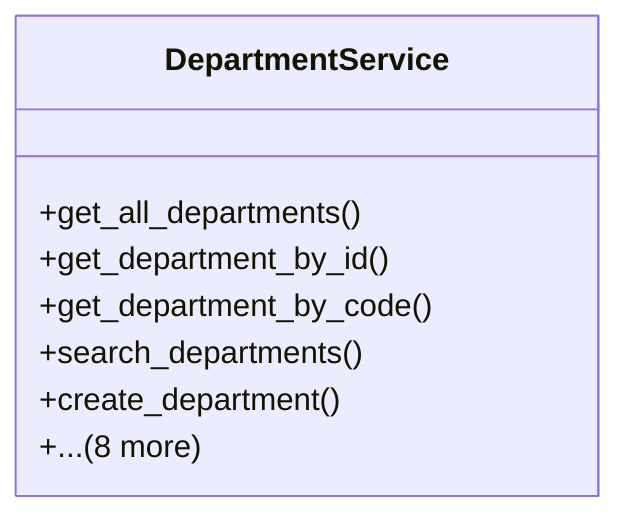

# services_modules.admin_affairs.services.department_service

## Imports
- django.db
- django.db.models
- django.utils
- models

## Classes
- DepartmentService
  - method: `get_all_departments`
  - method: `get_department_by_id`
  - method: `get_department_by_code`
  - method: `search_departments`
  - method: `create_department`
  - method: `update_department`
  - method: `delete_department`
  - method: `deactivate_department`
  - method: `activate_department`
  - method: `get_department_hierarchy`
  - method: `_get_sub_departments_recursive`
  - method: `get_departments_by_manager`
  - method: `get_employees_count_by_department`

## Functions
- get_all_departments
- get_department_by_id
- get_department_by_code
- search_departments
- create_department
- update_department
- delete_department
- deactivate_department
- activate_department
- get_department_hierarchy
- _get_sub_departments_recursive
- get_departments_by_manager
- get_employees_count_by_department

## Class Diagram

