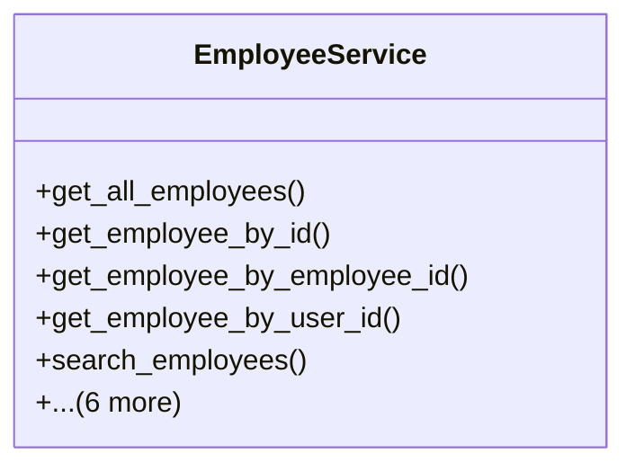

# services_modules.admin_affairs.services.employee_service

## Imports
- django.db
- django.db.models
- django.utils
- models

## Classes
- EmployeeService
  - method: `get_all_employees`
  - method: `get_employee_by_id`
  - method: `get_employee_by_employee_id`
  - method: `get_employee_by_user_id`
  - method: `search_employees`
  - method: `create_employee`
  - method: `update_employee`
  - method: `terminate_employee`
  - method: `get_employees_by_department`
  - method: `get_employees_by_position`
  - method: `transfer_employee`

## Functions
- get_all_employees
- get_employee_by_id
- get_employee_by_employee_id
- get_employee_by_user_id
- search_employees
- create_employee
- update_employee
- terminate_employee
- get_employees_by_department
- get_employees_by_position
- transfer_employee

## Class Diagram

