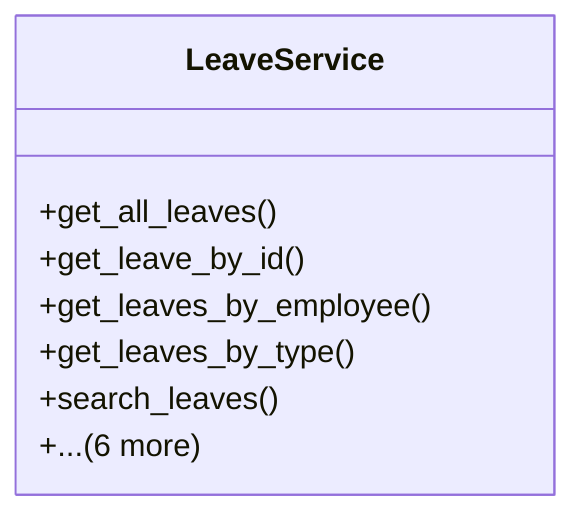

# services_modules.admin_affairs.services.leave_service

## Imports
- django.db
- django.db.models
- django.utils
- models

## Classes
- LeaveService
  - method: `get_all_leaves`
  - method: `get_leave_by_id`
  - method: `get_leaves_by_employee`
  - method: `get_leaves_by_type`
  - method: `search_leaves`
  - method: `create_leave`
  - method: `approve_leave`
  - method: `reject_leave`
  - method: `cancel_leave`
  - method: `get_leave_balance`
  - method: `get_leaves_by_date_range`

## Functions
- get_all_leaves
- get_leave_by_id
- get_leaves_by_employee
- get_leaves_by_type
- search_leaves
- create_leave
- approve_leave
- reject_leave
- cancel_leave
- get_leave_balance
- get_leaves_by_date_range

## Class Diagram

