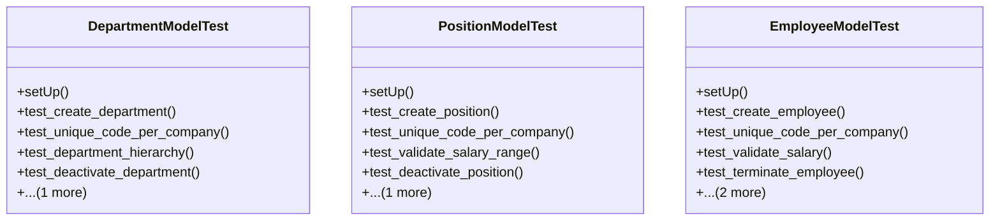

# services_modules.admin_affairs.tests.test_admin_affairs

## Imports
- datetime
- decimal
- django.core.exceptions
- django.db
- django.test
- django.utils
- models.department
- models.employee
- models.position
- services_modules.core.models

## Classes
- DepartmentModelTest
  - method: `setUp`
  - method: `test_create_department`
  - method: `test_unique_code_per_company`
  - method: `test_department_hierarchy`
  - method: `test_deactivate_department`
  - method: `test_get_all_employees`
- PositionModelTest
  - method: `setUp`
  - method: `test_create_position`
  - method: `test_unique_code_per_company`
  - method: `test_validate_salary_range`
  - method: `test_deactivate_position`
  - method: `test_get_all_employees`
- EmployeeModelTest
  - method: `setUp`
  - method: `test_create_employee`
  - method: `test_unique_code_per_company`
  - method: `test_validate_salary`
  - method: `test_terminate_employee`
  - method: `test_calculate_service_period`
  - method: `test_calculate_age`

## Functions
- setUp
- test_create_department
- test_unique_code_per_company
- test_department_hierarchy
- test_deactivate_department
- test_get_all_employees
- setUp
- test_create_position
- test_unique_code_per_company
- test_validate_salary_range
- test_deactivate_position
- test_get_all_employees
- setUp
- test_create_employee
- test_unique_code_per_company
- test_validate_salary
- test_terminate_employee
- test_calculate_service_period
- test_calculate_age
- mock_get_all_employees
- mock_get_all_employees
- mock_terminate
- mock_calculate_service_period
- mock_calculate_age

## Class Diagram

