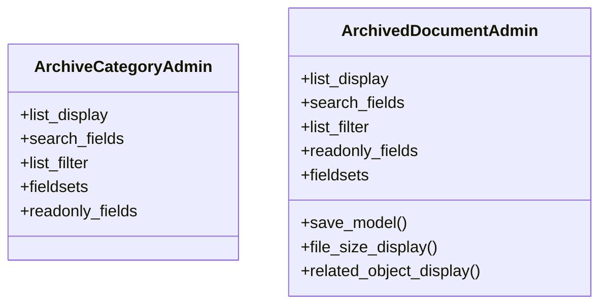

# services_modules.archiving_system.admin

## Imports
- django.contrib
- django.utils.translation
- models

## Classes
- ArchiveCategoryAdmin
  - attr: `list_display`
  - attr: `search_fields`
  - attr: `list_filter`
  - attr: `fieldsets`
  - attr: `readonly_fields`
- ArchivedDocumentAdmin
  - attr: `list_display`
  - attr: `search_fields`
  - attr: `list_filter`
  - attr: `readonly_fields`
  - attr: `fieldsets`
  - method: `save_model`
  - method: `file_size_display`
  - method: `related_object_display`

## Functions
- save_model
- file_size_display
- related_object_display

## Class Diagram

