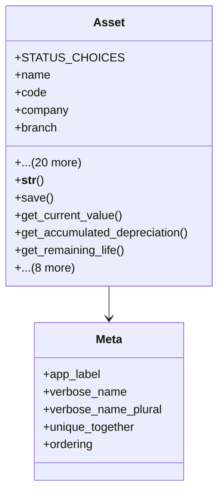

# services_modules.assets.models.asset

## Imports
- asset_category
- decimal
- depreciation
- django.contrib.auth
- django.core.validators
- django.db
- django.utils
- django.utils.translation
- math
- services_modules.accounting.models
- services_modules.core.models

## Classes
- Asset
  - attr: `STATUS_CHOICES`
  - attr: `name`
  - attr: `code`
  - attr: `company`
  - attr: `branch`
  - attr: `category`
  - attr: `purchase_date`
  - attr: `purchase_value`
  - attr: `salvage_value`
  - attr: `asset_account`
  - attr: `depreciation_account`
  - attr: `depreciation_method`
  - attr: `useful_life`
  - attr: `responsible_user`
  - attr: `location`
  - attr: `serial_number`
  - attr: `model`
  - attr: `manufacturer`
  - attr: `status`
  - attr: `disposal_date`
  - attr: `disposal_value`
  - attr: `disposal_reason`
  - attr: `notes`
  - attr: `created_at`
  - attr: `updated_at`
  - method: `__str__`
  - method: `save`
  - method: `get_current_value`
  - method: `get_accumulated_depreciation`
  - method: `get_remaining_life`
  - method: `get_depreciation_percentage`
  - method: `calculate_monthly_depreciation`
  - method: `mark_as_maintenance`
  - method: `mark_as_active`
  - method: `mark_as_inactive`
  - method: `dispose`
  - method: `get_maintenance_history`
  - method: `get_depreciation_schedule`
- Meta
  - attr: `app_label`
  - attr: `verbose_name`
  - attr: `verbose_name_plural`
  - attr: `unique_together`
  - attr: `ordering`

## Functions
- __str__
- save
- get_current_value
- get_accumulated_depreciation
- get_remaining_life
- get_depreciation_percentage
- calculate_monthly_depreciation
- mark_as_maintenance
- mark_as_active
- mark_as_inactive
- dispose
- get_maintenance_history
- get_depreciation_schedule

## Module Variables
- `User`

## Class Diagram

