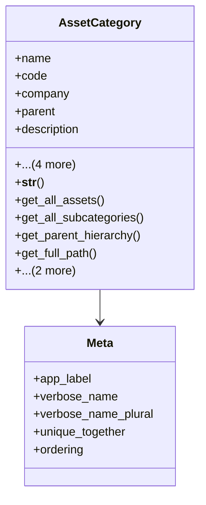

# services_modules.assets.models.asset_category

## Imports
- asset
- django.db
- django.utils.translation
- services_modules.core.models

## Classes
- AssetCategory
  - attr: `name`
  - attr: `code`
  - attr: `company`
  - attr: `parent`
  - attr: `description`
  - attr: `default_useful_life`
  - attr: `is_active`
  - attr: `created_at`
  - attr: `updated_at`
  - method: `__str__`
  - method: `get_all_assets`
  - method: `get_all_subcategories`
  - method: `get_parent_hierarchy`
  - method: `get_full_path`
  - method: `deactivate`
  - method: `activate`
- Meta
  - attr: `app_label`
  - attr: `verbose_name`
  - attr: `verbose_name_plural`
  - attr: `unique_together`
  - attr: `ordering`

## Functions
- __str__
- get_all_assets
- get_all_subcategories
- get_parent_hierarchy
- get_full_path
- deactivate
- activate

## Class Diagram

