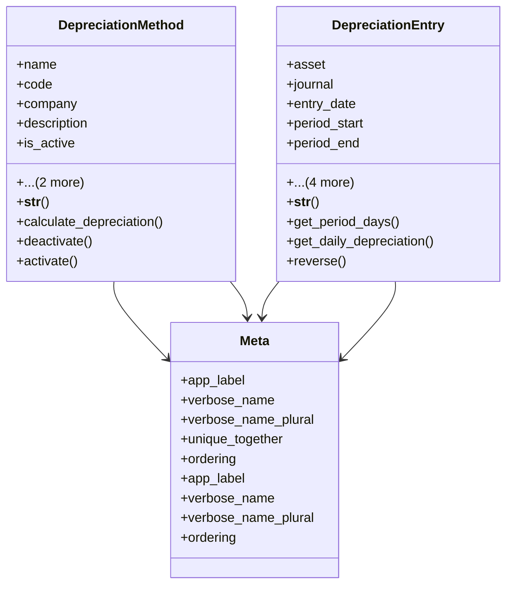

# services_modules.assets.models.depreciation

## Imports
- decimal
- django.core.validators
- django.db
- django.utils
- django.utils.translation
- services_modules.accounting.models
- services_modules.core.models

## Classes
- DepreciationMethod
  - attr: `name`
  - attr: `code`
  - attr: `company`
  - attr: `description`
  - attr: `is_active`
  - attr: `created_at`
  - attr: `updated_at`
  - method: `__str__`
  - method: `calculate_depreciation`
  - method: `deactivate`
  - method: `activate`
- DepreciationEntry
  - attr: `asset`
  - attr: `journal`
  - attr: `entry_date`
  - attr: `period_start`
  - attr: `period_end`
  - attr: `amount`
  - attr: `notes`
  - attr: `created_at`
  - attr: `updated_at`
  - method: `__str__`
  - method: `get_period_days`
  - method: `get_daily_depreciation`
  - method: `reverse`
- Meta
  - attr: `app_label`
  - attr: `verbose_name`
  - attr: `verbose_name_plural`
  - attr: `unique_together`
  - attr: `ordering`
- Meta
  - attr: `app_label`
  - attr: `verbose_name`
  - attr: `verbose_name_plural`
  - attr: `ordering`

## Functions
- __str__
- calculate_depreciation
- deactivate
- activate
- __str__
- get_period_days
- get_daily_depreciation
- reverse

## Class Diagram

