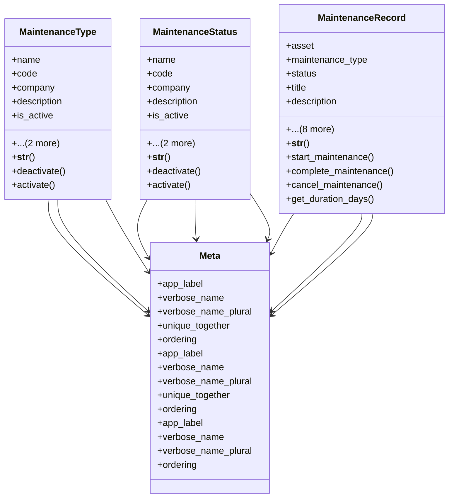

# services_modules.assets.models.maintenance

## Imports
- decimal
- django.contrib.auth
- django.core.validators
- django.db
- django.utils
- django.utils.translation
- services_modules.core.models

## Classes
- MaintenanceType
  - attr: `name`
  - attr: `code`
  - attr: `company`
  - attr: `description`
  - attr: `is_active`
  - attr: `created_at`
  - attr: `updated_at`
  - method: `__str__`
  - method: `deactivate`
  - method: `activate`
- MaintenanceStatus
  - attr: `name`
  - attr: `code`
  - attr: `company`
  - attr: `description`
  - attr: `is_active`
  - attr: `created_at`
  - attr: `updated_at`
  - method: `__str__`
  - method: `deactivate`
  - method: `activate`
- MaintenanceRecord
  - attr: `asset`
  - attr: `maintenance_type`
  - attr: `status`
  - attr: `title`
  - attr: `description`
  - attr: `scheduled_date`
  - attr: `start_date`
  - attr: `end_date`
  - attr: `cost`
  - attr: `performed_by`
  - attr: `notes`
  - attr: `created_at`
  - attr: `updated_at`
  - method: `__str__`
  - method: `start_maintenance`
  - method: `complete_maintenance`
  - method: `cancel_maintenance`
  - method: `get_duration_days`
- Meta
  - attr: `app_label`
  - attr: `verbose_name`
  - attr: `verbose_name_plural`
  - attr: `unique_together`
  - attr: `ordering`
- Meta
  - attr: `app_label`
  - attr: `verbose_name`
  - attr: `verbose_name_plural`
  - attr: `unique_together`
  - attr: `ordering`
- Meta
  - attr: `app_label`
  - attr: `verbose_name`
  - attr: `verbose_name_plural`
  - attr: `ordering`

## Functions
- __str__
- deactivate
- activate
- __str__
- deactivate
- activate
- __str__
- start_maintenance
- complete_maintenance
- cancel_maintenance
- get_duration_days

## Module Variables
- `User`

## Class Diagram

