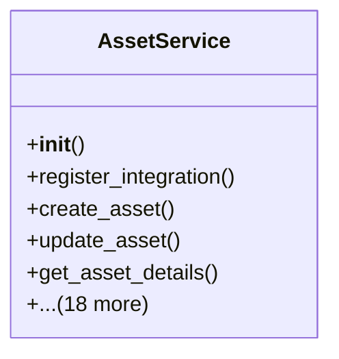

# services_modules.assets.services

## Imports
- datetime
- decimal
- django.db
- django.db.models
- django.utils
- logging
- models.asset
- models.asset_category
- models.depreciation
- models.maintenance

## Classes
- AssetService
  - method: `__init__`
  - method: `register_integration`
  - method: `create_asset`
  - method: `update_asset`
  - method: `get_asset_details`
  - method: `list_assets`
  - method: `update_asset_status`
  - method: `dispose_asset`
  - method: `create_asset_category`
  - method: `update_asset_category`
  - method: `list_asset_categories`
  - method: `create_depreciation_method`
  - method: `update_depreciation_method`
  - method: `list_depreciation_methods`
  - method: `create_depreciation_entry`
  - method: `calculate_depreciation`
  - method: `generate_depreciation_schedule`
  - method: `create_maintenance_record`
  - method: `update_maintenance_record`
  - method: `list_maintenance_records`
  - method: `get_asset_statistics`
  - method: `generate_asset_report`
  - method: `_build_category_hierarchy`

## Functions
- __init__
- register_integration
- create_asset
- update_asset
- get_asset_details
- list_assets
- update_asset_status
- dispose_asset
- create_asset_category
- update_asset_category
- list_asset_categories
- create_depreciation_method
- update_depreciation_method
- list_depreciation_methods
- create_depreciation_entry
- calculate_depreciation
- generate_depreciation_schedule
- create_maintenance_record
- update_maintenance_record
- list_maintenance_records
- get_asset_statistics
- generate_asset_report
- _build_category_hierarchy

## Module Variables
- `logger`

## Class Diagram

