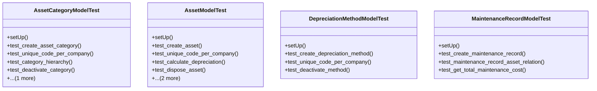

# services_modules.assets.tests.test_asset

## Imports
- datetime
- decimal
- django.core.exceptions
- django.db
- django.test
- django.utils
- models.asset
- models.depreciation
- models.maintenance
- services_modules.accounting.models
- services_modules.core.models

## Classes
- AssetCategoryModelTest
  - method: `setUp`
  - method: `test_create_asset_category`
  - method: `test_unique_code_per_company`
  - method: `test_category_hierarchy`
  - method: `test_deactivate_category`
  - method: `test_get_all_assets`
- AssetModelTest
  - method: `setUp`
  - method: `test_create_asset`
  - method: `test_unique_code_per_company`
  - method: `test_calculate_depreciation`
  - method: `test_dispose_asset`
  - method: `test_transfer_asset`
  - method: `test_get_maintenance_records`
- DepreciationMethodModelTest
  - method: `setUp`
  - method: `test_create_depreciation_method`
  - method: `test_unique_code_per_company`
  - method: `test_deactivate_method`
- MaintenanceRecordModelTest
  - method: `setUp`
  - method: `test_create_maintenance_record`
  - method: `test_maintenance_record_asset_relation`
  - method: `test_get_total_maintenance_cost`

## Functions
- setUp
- test_create_asset_category
- test_unique_code_per_company
- test_category_hierarchy
- test_deactivate_category
- test_get_all_assets
- setUp
- test_create_asset
- test_unique_code_per_company
- test_calculate_depreciation
- test_dispose_asset
- test_transfer_asset
- test_get_maintenance_records
- setUp
- test_create_depreciation_method
- test_unique_code_per_company
- test_deactivate_method
- setUp
- test_create_maintenance_record
- test_maintenance_record_asset_relation
- test_get_total_maintenance_cost
- mock_get_all_assets
- mock_calculate_depreciation
- mock_dispose
- mock_transfer
- mock_get_maintenance_records
- mock_get_total_maintenance_cost

## Class Diagram

