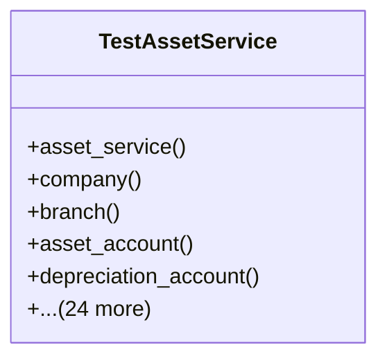

# services_modules.assets.tests.test_services

## Imports
- datetime
- decimal
- django.contrib.auth
- django.utils
- pytest
- services_modules.accounting.models
- services_modules.assets.models.asset
- services_modules.assets.models.asset_category
- services_modules.assets.models.depreciation
- services_modules.assets.models.maintenance
- services_modules.assets.services
- services_modules.core.models

## Classes
- TestAssetService
  - method: `asset_service`
  - method: `company`
  - method: `branch`
  - method: `asset_account`
  - method: `depreciation_account`
  - method: `depreciation_method`
  - method: `asset_category`
  - method: `user`
  - method: `asset_data`
  - method: `test_create_asset`
  - method: `test_update_asset`
  - method: `test_get_asset_details`
  - method: `test_list_assets`
  - method: `test_update_asset_status`
  - method: `test_dispose_asset`
  - method: `test_create_asset_category`
  - method: `test_update_asset_category`
  - method: `test_list_asset_categories`
  - method: `test_create_depreciation_method`
  - method: `test_update_depreciation_method`
  - method: `test_list_depreciation_methods`
  - method: `test_create_depreciation_entry`
  - method: `test_calculate_depreciation`
  - method: `test_generate_depreciation_schedule`
  - method: `test_create_maintenance_record`
  - method: `test_update_maintenance_record`
  - method: `test_list_maintenance_records`
  - method: `test_get_asset_statistics`
  - method: `test_generate_asset_report`

## Functions
- asset_service
- company
- branch
- asset_account
- depreciation_account
- depreciation_method
- asset_category
- user
- asset_data
- test_create_asset
- test_update_asset
- test_get_asset_details
- test_list_assets
- test_update_asset_status
- test_dispose_asset
- test_create_asset_category
- test_update_asset_category
- test_list_asset_categories
- test_create_depreciation_method
- test_update_depreciation_method
- test_list_depreciation_methods
- test_create_depreciation_entry
- test_calculate_depreciation
- test_generate_depreciation_schedule
- test_create_maintenance_record
- test_update_maintenance_record
- test_list_maintenance_records
- test_get_asset_statistics
- test_generate_asset_report

## Module Variables
- `User`

## Class Diagram

