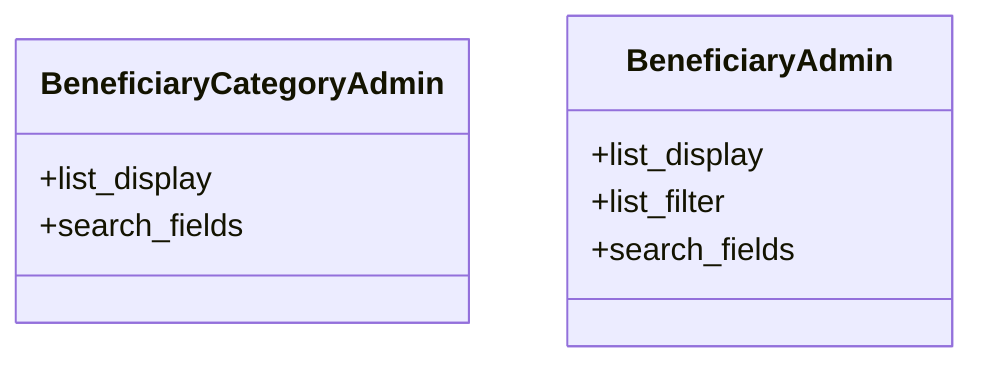

# services_modules.beneficiaries.admin

## Imports
- django.contrib
- django.utils.translation
- models.beneficiary
- models.beneficiary_category

## Classes
- BeneficiaryCategoryAdmin
  - attr: `list_display`
  - attr: `search_fields`
- BeneficiaryAdmin
  - attr: `list_display`
  - attr: `list_filter`
  - attr: `search_fields`

## Class Diagram

