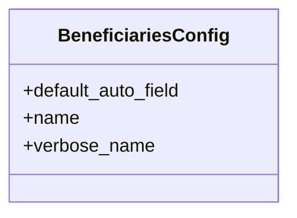

# services_modules.beneficiaries.apps

## Imports
- django.apps
- django.utils.translation

## Classes
- BeneficiariesConfig
  - attr: `default_auto_field`
  - attr: `name`
  - attr: `verbose_name`

## Class Diagram

