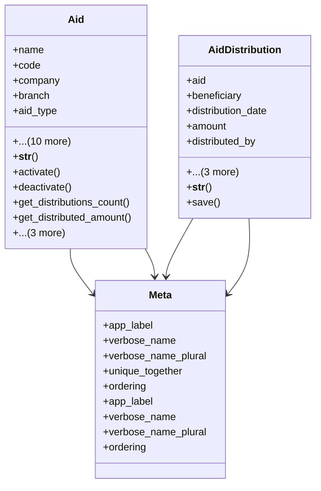

# services_modules.beneficiaries.models.aid

## Imports
- aid_type
- beneficiary
- core_modules.core.models
- core_modules.organization.models
- decimal
- django.contrib.auth
- django.core.validators
- django.db
- django.db.models
- django.utils
- django.utils.translation

## Classes
- Aid
  - attr: `name`
  - attr: `code`
  - attr: `company`
  - attr: `branch`
  - attr: `aid_type`
  - attr: `description`
  - attr: `start_date`
  - attr: `end_date`
  - attr: `total_amount`
  - attr: `currency`
  - attr: `responsible_user`
  - attr: `is_active`
  - attr: `notes`
  - attr: `created_at`
  - attr: `updated_at`
  - method: `__str__`
  - method: `activate`
  - method: `deactivate`
  - method: `get_distributions_count`
  - method: `get_distributed_amount`
  - method: `get_remaining_amount`
  - method: `is_fully_distributed`
  - method: `is_expired`
- AidDistribution
  - attr: `aid`
  - attr: `beneficiary`
  - attr: `distribution_date`
  - attr: `amount`
  - attr: `distributed_by`
  - attr: `notes`
  - attr: `created_at`
  - attr: `updated_at`
  - method: `__str__`
  - method: `save`
- Meta
  - attr: `app_label`
  - attr: `verbose_name`
  - attr: `verbose_name_plural`
  - attr: `unique_together`
  - attr: `ordering`
- Meta
  - attr: `app_label`
  - attr: `verbose_name`
  - attr: `verbose_name_plural`
  - attr: `ordering`

## Functions
- __str__
- activate
- deactivate
- get_distributions_count
- get_distributed_amount
- get_remaining_amount
- is_fully_distributed
- is_expired
- __str__
- save

## Module Variables
- `User`

## Class Diagram

