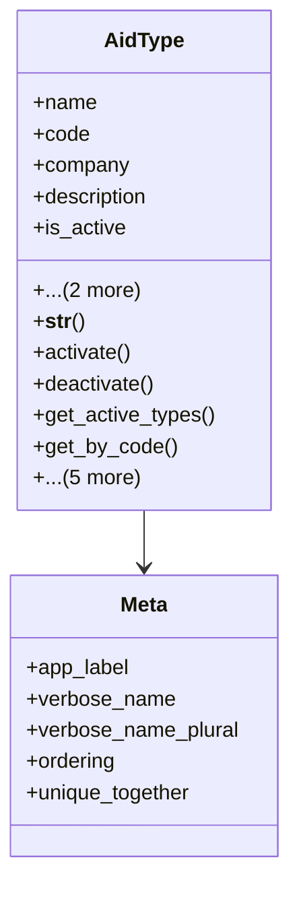

# services_modules.beneficiaries.models.aid_type

## Imports
- core_modules.companies.models
- django.db
- django.utils.translation

## Classes
- AidType
  - attr: `name`
  - attr: `code`
  - attr: `company`
  - attr: `description`
  - attr: `is_active`
  - attr: `created_at`
  - attr: `updated_at`
  - method: `__str__`
  - method: `activate`
  - method: `deactivate`
  - method: `get_active_types`
  - method: `get_by_code`
  - method: `can_be_deleted`
  - method: `get_statistics`
  - method: `full_name`
  - method: `status_display`
  - method: `save`
- Meta
  - attr: `app_label`
  - attr: `verbose_name`
  - attr: `verbose_name_plural`
  - attr: `ordering`
  - attr: `unique_together`

## Functions
- __str__
- activate
- deactivate
- get_active_types
- get_by_code
- can_be_deleted
- get_statistics
- full_name
- status_display
- save

## Class Diagram

