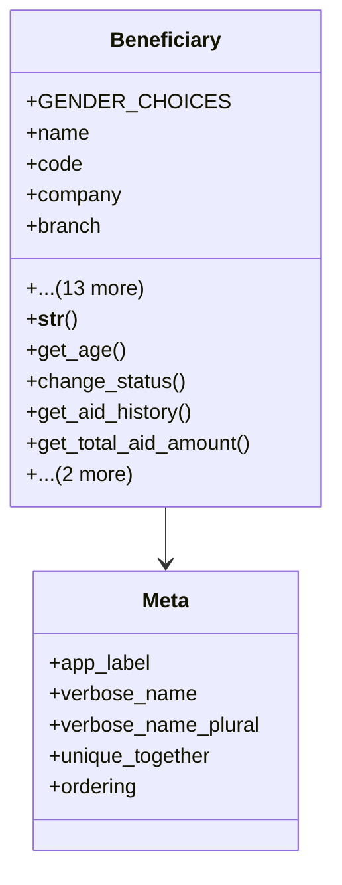

# services_modules.beneficiaries.models.beneficiary

## Imports
- aid
- beneficiary_category
- beneficiary_status
- core_modules.core.models
- decimal
- django.core.validators
- django.db
- django.db.models
- django.utils
- django.utils.translation

## Classes
- Beneficiary
  - attr: `GENDER_CHOICES`
  - attr: `name`
  - attr: `code`
  - attr: `company`
  - attr: `branch`
  - attr: `category`
  - attr: `status`
  - attr: `national_id`
  - attr: `gender`
  - attr: `date_of_birth`
  - attr: `phone`
  - attr: `address`
  - attr: `email`
  - attr: `family_members`
  - attr: `monthly_income`
  - attr: `notes`
  - attr: `created_at`
  - attr: `updated_at`
  - method: `__str__`
  - method: `get_age`
  - method: `change_status`
  - method: `get_aid_history`
  - method: `get_total_aid_amount`
  - method: `get_last_aid_date`
  - method: `is_eligible_for_aid`
- Meta
  - attr: `app_label`
  - attr: `verbose_name`
  - attr: `verbose_name_plural`
  - attr: `unique_together`
  - attr: `ordering`

## Functions
- __str__
- get_age
- change_status
- get_aid_history
- get_total_aid_amount
- get_last_aid_date
- is_eligible_for_aid

## Class Diagram

