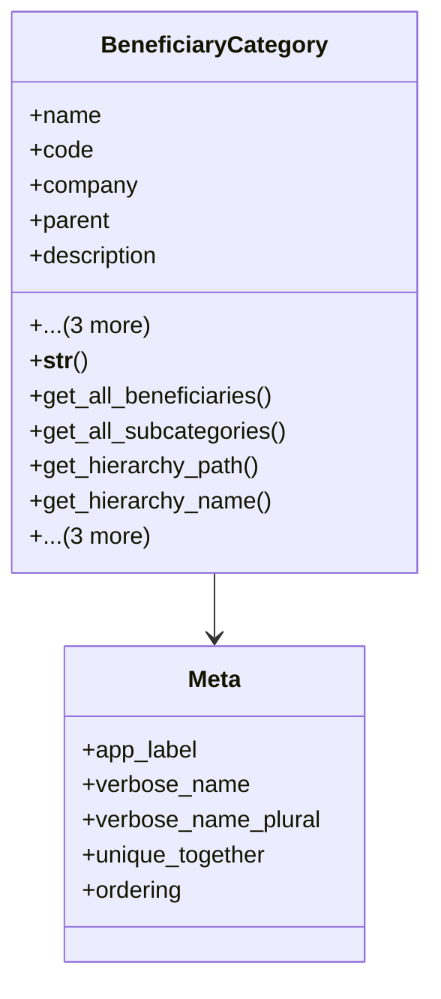

# services_modules.beneficiaries.models.beneficiary_category

## Imports
- beneficiary
- beneficiary_status
- core_modules.companies.models
- django.db
- django.utils.translation

## Classes
- BeneficiaryCategory
  - attr: `name`
  - attr: `code`
  - attr: `company`
  - attr: `parent`
  - attr: `description`
  - attr: `is_active`
  - attr: `created_at`
  - attr: `updated_at`
  - method: `__str__`
  - method: `get_all_beneficiaries`
  - method: `get_all_subcategories`
  - method: `get_hierarchy_path`
  - method: `get_hierarchy_name`
  - method: `activate`
  - method: `deactivate`
  - method: `get_active_beneficiaries_count`
- Meta
  - attr: `app_label`
  - attr: `verbose_name`
  - attr: `verbose_name_plural`
  - attr: `unique_together`
  - attr: `ordering`

## Functions
- __str__
- get_all_beneficiaries
- get_all_subcategories
- get_hierarchy_path
- get_hierarchy_name
- activate
- deactivate
- get_active_beneficiaries_count

## Class Diagram

