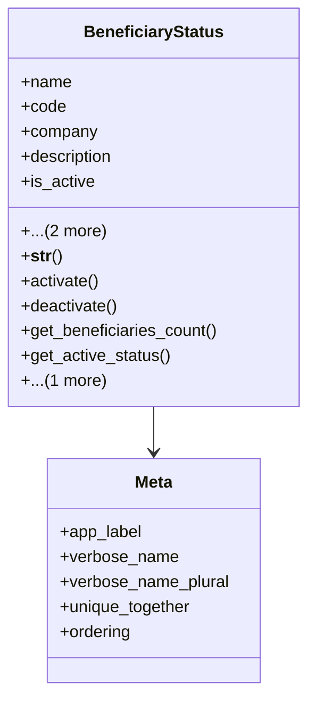

# services_modules.beneficiaries.models.beneficiary_status

## Imports
- beneficiary
- core_modules.companies.models
- django.db
- django.utils.translation

## Classes
- BeneficiaryStatus
  - attr: `name`
  - attr: `code`
  - attr: `company`
  - attr: `description`
  - attr: `is_active`
  - attr: `created_at`
  - attr: `updated_at`
  - method: `__str__`
  - method: `activate`
  - method: `deactivate`
  - method: `get_beneficiaries_count`
  - method: `get_active_status`
  - method: `get_inactive_status`
- Meta
  - attr: `app_label`
  - attr: `verbose_name`
  - attr: `verbose_name_plural`
  - attr: `unique_together`
  - attr: `ordering`

## Functions
- __str__
- activate
- deactivate
- get_beneficiaries_count
- get_active_status
- get_inactive_status

## Class Diagram

