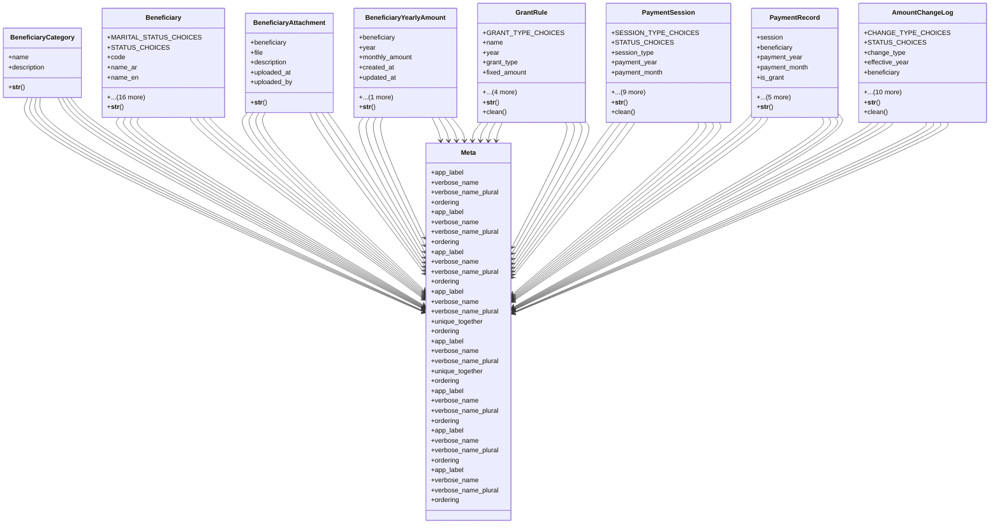

# services_modules.beneficiaries.models

## Imports
- django.contrib.auth
- django.core.exceptions
- django.db
- django.utils
- django.utils.translation
- os

## Classes
- BeneficiaryCategory
  - attr: `name`
  - attr: `description`
  - method: `__str__`
- Beneficiary
  - attr: `MARITAL_STATUS_CHOICES`
  - attr: `STATUS_CHOICES`
  - attr: `code`
  - attr: `name_ar`
  - attr: `name_en`
  - attr: `category`
  - attr: `national_id`
  - attr: `address`
  - attr: `contact_info`
  - attr: `marital_status`
  - attr: `family_members_count`
  - attr: `spouse_name`
  - attr: `case_details`
  - attr: `case_national_id`
  - attr: `researcher_name`
  - attr: `notes`
  - attr: `status`
  - attr: `first_payment_month`
  - attr: `photo`
  - attr: `created_at`
  - attr: `updated_at`
  - method: `__str__`
- BeneficiaryAttachment
  - attr: `beneficiary`
  - attr: `file`
  - attr: `description`
  - attr: `uploaded_at`
  - attr: `uploaded_by`
  - method: `__str__`
- BeneficiaryYearlyAmount
  - attr: `beneficiary`
  - attr: `year`
  - attr: `monthly_amount`
  - attr: `created_at`
  - attr: `updated_at`
  - attr: `set_by`
  - method: `__str__`
- GrantRule
  - attr: `GRANT_TYPE_CHOICES`
  - attr: `name`
  - attr: `year`
  - attr: `grant_type`
  - attr: `fixed_amount`
  - attr: `apply_after_month`
  - attr: `is_active`
  - attr: `created_at`
  - attr: `updated_at`
  - method: `__str__`
  - method: `clean`
- PaymentSession
  - attr: `SESSION_TYPE_CHOICES`
  - attr: `STATUS_CHOICES`
  - attr: `session_type`
  - attr: `payment_year`
  - attr: `payment_month`
  - attr: `grant_rule`
  - attr: `session_date`
  - attr: `description`
  - attr: `status`
  - attr: `created_by`
  - attr: `posted_by`
  - attr: `posted_at`
  - attr: `created_at`
  - attr: `updated_at`
  - method: `__str__`
  - method: `clean`
- PaymentRecord
  - attr: `session`
  - attr: `beneficiary`
  - attr: `payment_year`
  - attr: `payment_month`
  - attr: `is_grant`
  - attr: `grant_name`
  - attr: `amount`
  - attr: `payment_date`
  - attr: `paid_by`
  - attr: `notes`
  - method: `__str__`
- AmountChangeLog
  - attr: `CHANGE_TYPE_CHOICES`
  - attr: `STATUS_CHOICES`
  - attr: `change_type`
  - attr: `effective_year`
  - attr: `beneficiary`
  - attr: `category`
  - attr: `old_amount`
  - attr: `new_amount`
  - attr: `percentage_change`
  - attr: `status`
  - attr: `created_by`
  - attr: `posted_by`
  - attr: `posted_at`
  - attr: `created_at`
  - attr: `notes`
  - method: `__str__`
  - method: `clean`
- Meta
  - attr: `app_label`
  - attr: `verbose_name`
  - attr: `verbose_name_plural`
  - attr: `ordering`
- Meta
  - attr: `app_label`
  - attr: `verbose_name`
  - attr: `verbose_name_plural`
  - attr: `ordering`
- Meta
  - attr: `app_label`
  - attr: `verbose_name`
  - attr: `verbose_name_plural`
  - attr: `ordering`
- Meta
  - attr: `app_label`
  - attr: `verbose_name`
  - attr: `verbose_name_plural`
  - attr: `unique_together`
  - attr: `ordering`
- Meta
  - attr: `app_label`
  - attr: `verbose_name`
  - attr: `verbose_name_plural`
  - attr: `unique_together`
  - attr: `ordering`
- Meta
  - attr: `app_label`
  - attr: `verbose_name`
  - attr: `verbose_name_plural`
  - attr: `ordering`
- Meta
  - attr: `app_label`
  - attr: `verbose_name`
  - attr: `verbose_name_plural`
  - attr: `ordering`
- Meta
  - attr: `app_label`
  - attr: `verbose_name`
  - attr: `verbose_name_plural`
  - attr: `ordering`

## Functions
- __str__
- __str__
- __str__
- __str__
- __str__
- clean
- __str__
- clean
- __str__
- __str__
- clean

## Module Variables
- `User`

## Class Diagram

