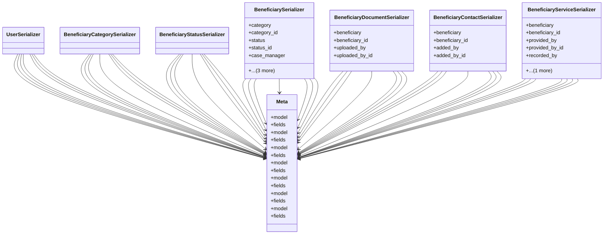

# services_modules.beneficiaries.serializers

## Imports
- django.contrib.auth.models
- django.db
- models
- rest_framework

## Classes
- UserSerializer
- BeneficiaryCategorySerializer
- BeneficiaryStatusSerializer
- BeneficiarySerializer
  - attr: `category`
  - attr: `category_id`
  - attr: `status`
  - attr: `status_id`
  - attr: `case_manager`
  - attr: `case_manager_id`
  - attr: `registered_by`
  - attr: `registered_by_id`
- BeneficiaryDocumentSerializer
  - attr: `beneficiary`
  - attr: `beneficiary_id`
  - attr: `uploaded_by`
  - attr: `uploaded_by_id`
- BeneficiaryContactSerializer
  - attr: `beneficiary`
  - attr: `beneficiary_id`
  - attr: `added_by`
  - attr: `added_by_id`
- BeneficiaryServiceSerializer
  - attr: `beneficiary`
  - attr: `beneficiary_id`
  - attr: `provided_by`
  - attr: `provided_by_id`
  - attr: `recorded_by`
  - attr: `recorded_by_id`
- Meta
  - attr: `model`
  - attr: `fields`
- Meta
  - attr: `model`
  - attr: `fields`
- Meta
  - attr: `model`
  - attr: `fields`
- Meta
  - attr: `model`
  - attr: `fields`
- Meta
  - attr: `model`
  - attr: `fields`
- Meta
  - attr: `model`
  - attr: `fields`
- Meta
  - attr: `model`
  - attr: `fields`

## Class Diagram

