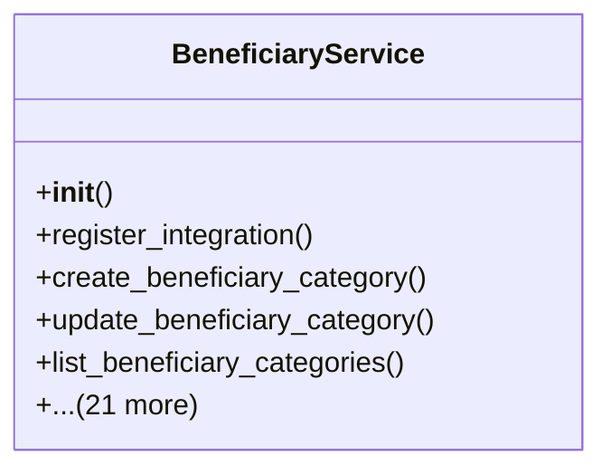

# services_modules.beneficiaries.services

## Imports
- datetime
- decimal
- django.contrib.auth
- django.db
- django.db.models
- django.utils
- logging
- models

## Classes
- BeneficiaryService
  - method: `__init__`
  - method: `register_integration`
  - method: `create_beneficiary_category`
  - method: `update_beneficiary_category`
  - method: `list_beneficiary_categories`
  - method: `create_beneficiary`
  - method: `update_beneficiary`
  - method: `get_beneficiary_details`
  - method: `list_beneficiaries`
  - method: `add_beneficiary_attachment`
  - method: `delete_beneficiary_attachment`
  - method: `set_beneficiary_yearly_amount`
  - method: `get_beneficiary_yearly_amount`
  - method: `create_grant_rule`
  - method: `update_grant_rule`
  - method: `list_grant_rules`
  - method: `create_payment_session`
  - method: `post_payment_session`
  - method: `_generate_monthly_payment_records`
  - method: `_generate_grant_payment_records`
  - method: `list_payment_sessions`
  - method: `get_payment_session_details`
  - method: `log_amount_change`
  - method: `apply_amount_change`
  - method: `get_beneficiary_statistics`
  - method: `generate_beneficiary_report`

## Functions
- __init__
- register_integration
- create_beneficiary_category
- update_beneficiary_category
- list_beneficiary_categories
- create_beneficiary
- update_beneficiary
- get_beneficiary_details
- list_beneficiaries
- add_beneficiary_attachment
- delete_beneficiary_attachment
- set_beneficiary_yearly_amount
- get_beneficiary_yearly_amount
- create_grant_rule
- update_grant_rule
- list_grant_rules
- create_payment_session
- post_payment_session
- _generate_monthly_payment_records
- _generate_grant_payment_records
- list_payment_sessions
- get_payment_session_details
- log_amount_change
- apply_amount_change
- get_beneficiary_statistics
- generate_beneficiary_report

## Module Variables
- `User`
- `logger`

## Class Diagram

