# services_modules.beneficiaries.tests.test_beneficiary

## Imports
- datetime
- decimal
- django.core.exceptions
- django.db
- django.db.models
- django.test
- django.utils
- models.aid
- models.beneficiary
- services_modules.core.models

## Classes
- BeneficiaryCategoryModelTest
  - method: `setUp`
  - method: `test_create_beneficiary_category`
  - method: `test_unique_code_per_company`
  - method: `test_category_hierarchy`
  - method: `test_deactivate_category`
  - method: `test_get_all_beneficiaries`
- BeneficiaryStatusModelTest
  - method: `setUp`
  - method: `test_create_beneficiary_status`
  - method: `test_unique_code_per_company`
  - method: `test_deactivate_status`
- BeneficiaryModelTest
  - method: `setUp`
  - method: `test_create_beneficiary`
  - method: `test_unique_code_per_company`
  - method: `test_unique_national_id_per_company`
  - method: `test_calculate_age`
  - method: `test_change_status`
  - method: `test_get_aid_history`
- AidTypeModelTest
  - method: `setUp`
  - method: `test_create_aid_type`
  - method: `test_unique_code_per_company`
  - method: `test_deactivate_aid_type`
- AidModelTest
  - method: `setUp`
  - method: `test_create_aid`
  - method: `test_unique_code_per_company`
  - method: `test_deactivate_aid`
  - method: `test_get_total_distributions`
- AidDistributionModelTest
  - method: `setUp`
  - method: `test_create_aid_distribution`
  - method: `test_total_distributed_amount`
  - method: `test_get_beneficiary_distributions`
  - method: `test_get_aid_distributions`

## Functions
- setUp
- test_create_beneficiary_category
- test_unique_code_per_company
- test_category_hierarchy
- test_deactivate_category
- test_get_all_beneficiaries
- setUp
- test_create_beneficiary_status
- test_unique_code_per_company
- test_deactivate_status
- setUp
- test_create_beneficiary
- test_unique_code_per_company
- test_unique_national_id_per_company
- test_calculate_age
- test_change_status
- test_get_aid_history
- setUp
- test_create_aid_type
- test_unique_code_per_company
- test_deactivate_aid_type
- setUp
- test_create_aid
- test_unique_code_per_company
- test_deactivate_aid
- test_get_total_distributions
- setUp
- test_create_aid_distribution
- test_total_distributed_amount
- test_get_beneficiary_distributions
- test_get_aid_distributions
- mock_get_all_beneficiaries

## Class Diagram

```mermaid
classDiagram
    class BeneficiaryCategoryModelTest {
        +setUp()
        +test_create_beneficiary_category()
        +test_unique_code_per_company()
        +test_category_hierarchy()
        +test_deactivate_category()
        +... (1 more)
    }
    class BeneficiaryStatusModelTest {
        +setUp()
        +test_create_beneficiary_status()
        +test_unique_code_per_company()
        +test_deactivate_status()
    }
    class BeneficiaryModelTest {
        +setUp()
        +test_create_beneficiary()
        +test_unique_code_per_company()
        +test_unique_national_id_per_company()
        +test_calculate_age()
        +... (2 more)
    }
    class AidTypeModelTest {
        +setUp()
        +test_create_aid_type()
        +test_unique_code_per_company()
        +test_deactivate_aid_type()
    }
    class AidModelTest {
        +setUp()
        +test_create_aid()
        +test_unique_code_per_company()
        +test_deactivate_aid()
        +test_get_total_distributions()
    }
    class AidDistributionModelTest {
        +setUp()
        +test_create_aid_distribution()
        +test_total_distributed_amount()
        +test_get_beneficiary_distributions()
        +test_get_aid_distributions()
    }
```

