# services_modules.beneficiaries.tests.test_services

## Imports
- datetime
- decimal
- django.contrib.auth
- django.core.files.uploadedfile
- django.utils
- pytest
- services_modules.beneficiaries.models
- services_modules.beneficiaries.services

## Classes
- TestBeneficiaryCategoryServices
  - method: `test_create_beneficiary_category`
  - method: `test_update_beneficiary_category`
  - method: `test_list_beneficiary_categories`
- TestBeneficiaryServices
  - method: `test_create_beneficiary`
  - method: `test_update_beneficiary`
  - method: `test_get_beneficiary_details`
  - method: `test_list_beneficiaries`
- TestBeneficiaryAttachmentServices
  - method: `test_add_beneficiary_attachment`
  - method: `test_delete_beneficiary_attachment`
- TestBeneficiaryYearlyAmountServices
  - method: `test_set_beneficiary_yearly_amount`
  - method: `test_get_beneficiary_yearly_amount`
- TestGrantRuleServices
  - method: `test_create_grant_rule`
  - method: `test_update_grant_rule`
  - method: `test_list_grant_rules`
- TestPaymentSessionServices
  - method: `test_create_payment_session`
  - method: `test_post_payment_session`
  - method: `test_list_payment_sessions`
  - method: `test_get_payment_session_details`
- TestAmountChangeLogServices
  - method: `test_log_amount_change`
  - method: `test_apply_amount_change`
- TestStatisticsAndReportServices
  - method: `test_get_beneficiary_statistics`
  - method: `test_generate_beneficiary_report`

## Functions
- beneficiary_service
- test_user
- test_category
- test_beneficiary
- test_yearly_amount
- test_grant_rule
- test_payment_session
- test_create_beneficiary_category
- test_update_beneficiary_category
- test_list_beneficiary_categories
- test_create_beneficiary
- test_update_beneficiary
- test_get_beneficiary_details
- test_list_beneficiaries
- test_add_beneficiary_attachment
- test_delete_beneficiary_attachment
- test_set_beneficiary_yearly_amount
- test_get_beneficiary_yearly_amount
- test_create_grant_rule
- test_update_grant_rule
- test_list_grant_rules
- test_create_payment_session
- test_post_payment_session
- test_list_payment_sessions
- test_get_payment_session_details
- test_log_amount_change
- test_apply_amount_change
- test_get_beneficiary_statistics
- test_generate_beneficiary_report

## Module Variables
- `User`

## Class Diagram

```mermaid
classDiagram
    class TestBeneficiaryCategoryServices {
        +test_create_beneficiary_category()
        +test_update_beneficiary_category()
        +test_list_beneficiary_categories()
    }
    class TestBeneficiaryServices {
        +test_create_beneficiary()
        +test_update_beneficiary()
        +test_get_beneficiary_details()
        +test_list_beneficiaries()
    }
    class TestBeneficiaryAttachmentServices {
        +test_add_beneficiary_attachment()
        +test_delete_beneficiary_attachment()
    }
    class TestBeneficiaryYearlyAmountServices {
        +test_set_beneficiary_yearly_amount()
        +test_get_beneficiary_yearly_amount()
    }
    class TestGrantRuleServices {
        +test_create_grant_rule()
        +test_update_grant_rule()
        +test_list_grant_rules()
    }
    class TestPaymentSessionServices {
        +test_create_payment_session()
        +test_post_payment_session()
        +test_list_payment_sessions()
        +test_get_payment_session_details()
    }
    class TestAmountChangeLogServices {
        +test_log_amount_change()
        +test_apply_amount_change()
    }
    class TestStatisticsAndReportServices {
        +test_get_beneficiary_statistics()
        +test_generate_beneficiary_report()
    }
```

