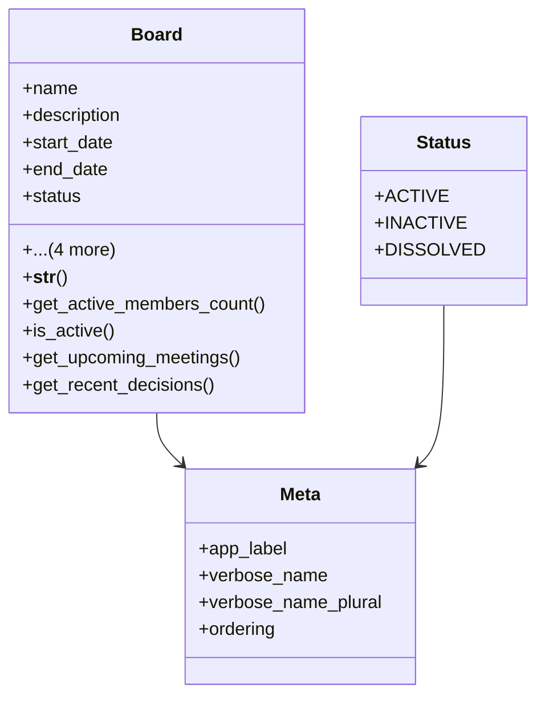

# services_modules.board_management.models.board

## Imports
- __future__
- django.contrib.auth
- django.db
- django.db.models
- django.utils
- django.utils.translation
- services_modules.board_management.models

## Classes
- Board
  - attr: `name`
  - attr: `description`
  - attr: `start_date`
  - attr: `end_date`
  - attr: `status`
  - attr: `chairman`
  - attr: `secretary`
  - attr: `created_at`
  - attr: `updated_at`
  - method: `__str__`
  - method: `get_active_members_count`
  - method: `is_active`
  - method: `get_upcoming_meetings`
  - method: `get_recent_decisions`
- Status
  - attr: `ACTIVE`
  - attr: `INACTIVE`
  - attr: `DISSOLVED`
- Meta
  - attr: `app_label`
  - attr: `verbose_name`
  - attr: `verbose_name_plural`
  - attr: `ordering`

## Functions
- __str__
- get_active_members_count
- is_active
- get_upcoming_meetings
- get_recent_decisions

## Module Variables
- `User`

## Class Diagram

