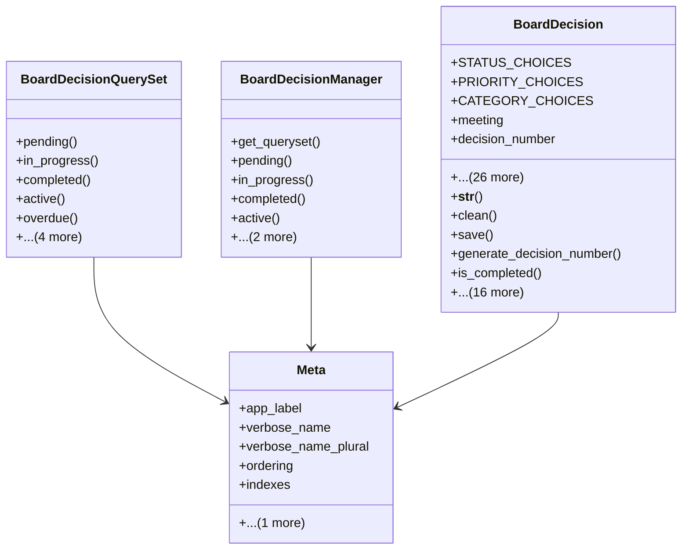

# services_modules.board_management.models.board_decision

## Imports
- board_meeting
- datetime
- django.contrib.auth
- django.core.exceptions
- django.db
- django.urls
- django.utils
- django.utils.translation

## Classes
- BoardDecisionQuerySet
  - method: `pending`
  - method: `in_progress`
  - method: `completed`
  - method: `active`
  - method: `overdue`
  - method: `upcoming`
  - method: `by_responsible`
  - method: `by_board`
  - method: `by_year`
- BoardDecisionManager
  - method: `get_queryset`
  - method: `pending`
  - method: `in_progress`
  - method: `completed`
  - method: `active`
  - method: `overdue`
  - method: `upcoming`
- BoardDecision
  - attr: `STATUS_CHOICES`
  - attr: `PRIORITY_CHOICES`
  - attr: `CATEGORY_CHOICES`
  - attr: `meeting`
  - attr: `decision_number`
  - attr: `title`
  - attr: `description`
  - attr: `category`
  - attr: `priority`
  - attr: `status`
  - attr: `decision_date`
  - attr: `implementation_date`
  - attr: `actual_implementation_date`
  - attr: `responsible`
  - attr: `assigned_team`
  - attr: `budget_allocated`
  - attr: `budget_spent`
  - attr: `progress_percentage`
  - attr: `attachments`
  - attr: `related_decisions`
  - attr: `notes`
  - attr: `is_confidential`
  - attr: `requires_follow_up`
  - attr: `follow_up_date`
  - attr: `completion_notes`
  - attr: `cancellation_reason`
  - attr: `created_by`
  - attr: `updated_by`
  - attr: `created_at`
  - attr: `updated_at`
  - attr: `objects`
  - method: `__str__`
  - method: `clean`
  - method: `save`
  - method: `generate_decision_number`
  - method: `is_completed`
  - method: `is_pending`
  - method: `is_in_progress`
  - method: `is_active`
  - method: `is_overdue`
  - method: `get_days_until_implementation`
  - method: `get_days_overdue`
  - method: `get_board`
  - method: `get_budget_usage_percentage`
  - method: `can_edit`
  - method: `can_view`
  - method: `update_status`
  - method: `get_absolute_url`
  - method: `get_status_color`
  - method: `get_priority_color`
  - method: `is_budget_exceeded`
  - method: `get_statistics`
- Meta
  - attr: `app_label`
  - attr: `verbose_name`
  - attr: `verbose_name_plural`
  - attr: `ordering`
  - attr: `indexes`
  - attr: `permissions`

## Functions
- pending
- in_progress
- completed
- active
- overdue
- upcoming
- by_responsible
- by_board
- by_year
- get_queryset
- pending
- in_progress
- completed
- active
- overdue
- upcoming
- __str__
- clean
- save
- generate_decision_number
- is_completed
- is_pending
- is_in_progress
- is_active
- is_overdue
- get_days_until_implementation
- get_days_overdue
- get_board
- get_budget_usage_percentage
- can_edit
- can_view
- update_status
- get_absolute_url
- get_status_color
- get_priority_color
- is_budget_exceeded
- get_statistics

## Module Variables
- `User`

## Class Diagram

